# C4 - Component Diagram: Vehicle Module

Спецификация компонентного уровня (C3) архитектурной модели C4 для модуля управления транспортными средствами (`Vehicle Module`) системы «Карманный гараж».

---

## 1. Назначение

Документ описывает внутреннюю структуру, декомпозицию на компоненты, распределение обязанностей и механизмы взаимодействия внутри `Vehicle Module`. 

Модуль реализует ключевой пользовательский сценарий добавления ТС в гараж:
1. Ввод 17-значного VIN-кода пользователем;
2. Получение и нормализация характеристик ТС от внешнего источника;
3. Формирование и отображение временного снимка данных (`Vehicle Preview`);
4. Подтверждение и персистентное сохранение объекта `Vehicle` в базе данных.

---

## 2. Component Diagram

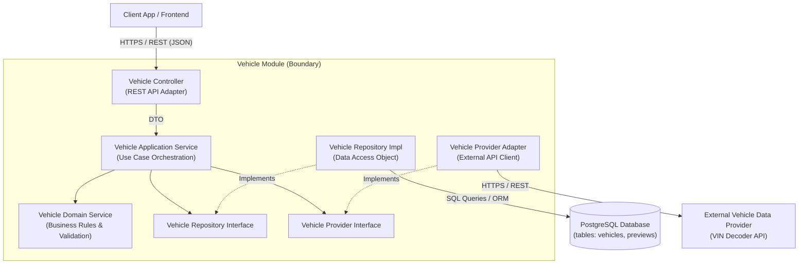

---

## 3. Спецификация компонентов (Components Detail)

### 3.1. Vehicle Controller

* **Назначение:** Точка входа HTTP API для модуля управления ТС.
* **Ответственность:**
* Прием и первичная десериализация HTTP-запросов;
* Валидация структуры входного JSON (DTO);
* Извлечение контекста авторизованного пользователя (`UserId` из JWT);
* Делегирование вызова в `Vehicle Application Service`;
* Маппинг доменных результатов и исключений в соответствующие HTTP-ответы (200, 201, 400, 404, 500).


### 3.2. Vehicle Application Service

* **Назначение:** Слой оркестрации пользовательских сценариев (Use Cases).
* **Ответственность:**
* Управление последовательностью исполнения сценариев: `lookupVehicleByVin()`, `createVehicle()`, `getVehicleById()`, `getUserVehicles()`, `updateVehicle()`;
* Управление границами локальных транзакций;
* Координация взаимодействия между Domain Service, Repository и Provider.


### 3.3. Vehicle Domain Service

* **Назначение:** Ядро бизнес-логики и правил домена ТС.
* **Ответственность:**
* Проверка валидности формата VIN (контрольные суммы, синтаксис ISO 3779);
* Нормализация текстовых полей VIN (приведение к верхнему регистру, удаление спецсимволов);
* Проверка доменных ограничений (например, максимальное количество ТС у одного пользователя);
* Проверка возможности сохранения ТС в базу.


### 3.4. Vehicle Repository Interface & Implementation

* **Назначение:** Абстракция слоя хранения данных (Pattern Repository).
* **Ответственность:**
* Предоставление чистых CRUD-методов для работы с сущностями `Vehicle` и `Vehicle Preview`;
* Изоляция слоя приложений от деталей реализации базы данных и ORM;
* Выполнение SQL-запросов к PostgreSQL.


### 3.5. Vehicle Provider Interface & Adapter

* **Назначение:** Изоляция внешних интеграций по декодированию VIN (Pattern Adapter).
* **Ответственность:**
* Трансляция внутренних доменных запросов во внешние HTTP-вызовы;
* Аутентификация во внешнем API (API Keys / Bearer tokens);
* Обработка сетевых ошибок, таймаутов и повторных попыток (Retry Policy);
* Маппинг внешнего неупорядоченного ответа в стандартизированный внутренний DTO.


---

## 4. Матрица ответственности компонентов

| Компонент | Тип компонента | Основная ответственность |
| --- | --- | --- |
| **Vehicle Controller** | API Gate / Interface | Прием HTTP-запросов, авторизация, сериализация DTO |
| **Vehicle Application Service** | Application Layer | Оркестрация Use Cases, управление транзакциями |
| **Vehicle Domain Service** | Domain Layer | Валидация VIN, соблюдение доменных инвариантов |
| **Vehicle Repository** | Infrastructure Layer | Абстракция работы с СУБД PostgreSQL |
| **Vehicle Provider Interface** | Contract | Внутренний контракт получения данных по VIN |
| **Vehicle Provider Adapter** | Infrastructure Layer | Клиент внешнего REST API декодирования VIN |

---

## 5. Правила архитектурных зависимостей (Dependency Rules)

Для соблюдения принципов Clean / Hexagonal Architecture внутри модуля действуют следующие строгие правила:

### Rule 1: Изоляция Controller

Контроллер передает управление на слой приложений и не содержит логики принятия решений.

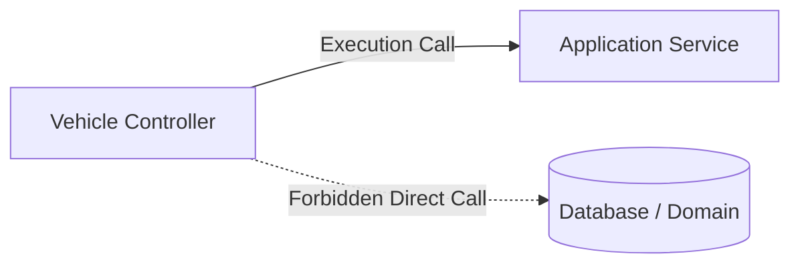

### Rule 2: Изоляция базы данных

Слой приложений взаимодействует с базой только через абстракцию `Repository Interface`.

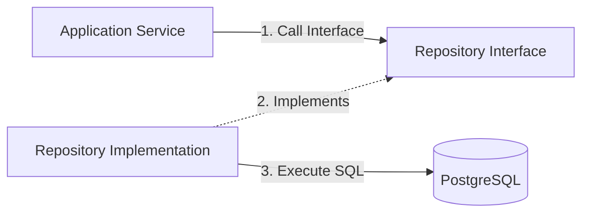

### Rule 3: Изоляция внешних поставщиков (Adapter Pattern)

Бизнес-логика не имеет прямого знания о структуре API сторонних провайдеров.

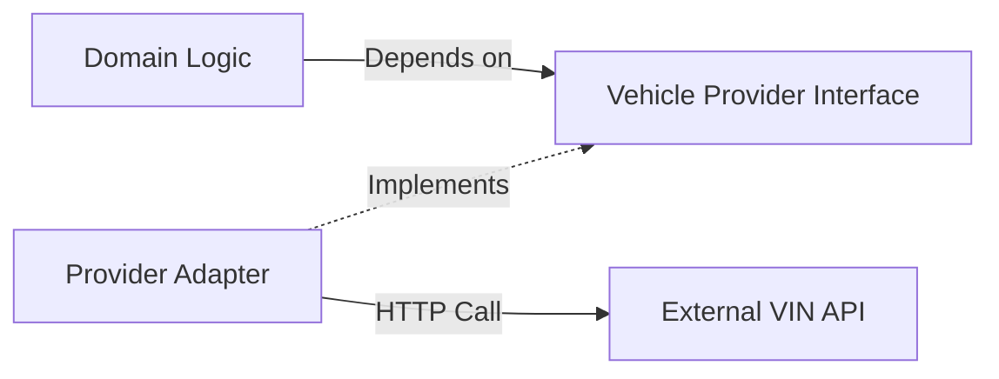

---

## 6. Sequence Diagram: Поиск ТС по VIN (Lookup Vehicle)

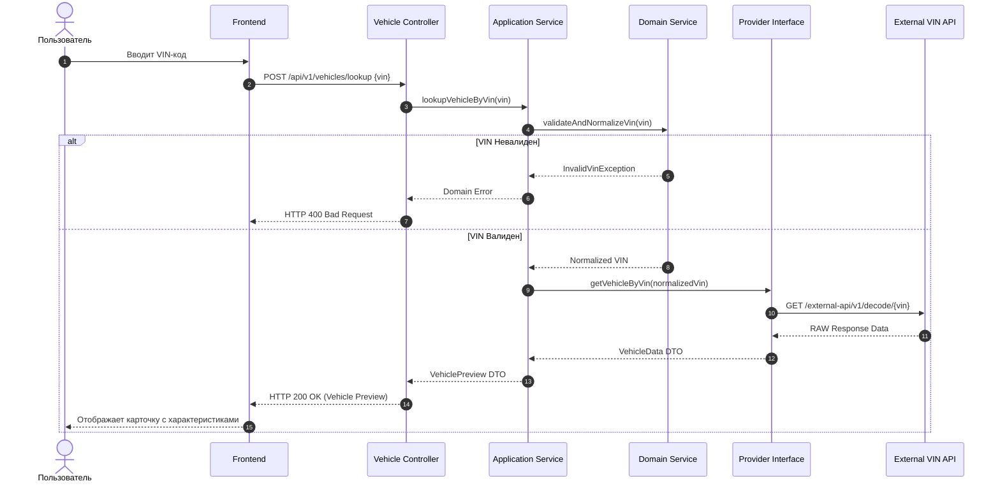

---

## 7. Sequence Diagram: Создание ТС (Create Vehicle)

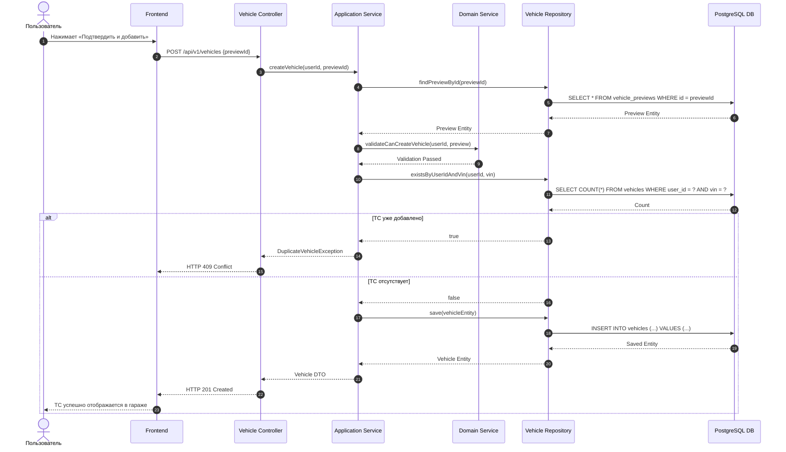

---

## 8. Sequence Diagram: Обработка ошибок валидации VIN

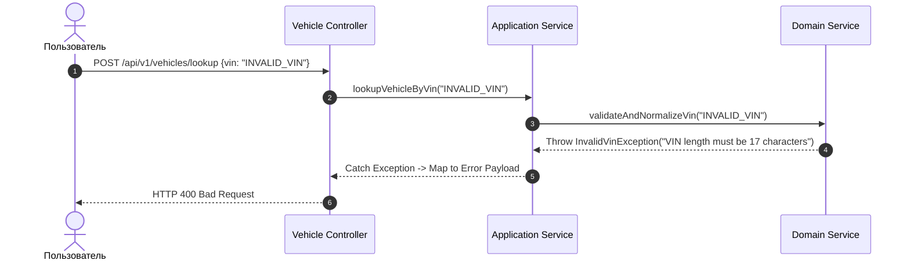

**Формат ответа при ошибке валидации:**

```json
{
  "error": {
    "code": "INVALID_VIN_FORMAT",
    "message": "Введенный VIN-код не соответствует стандарту ISO 3779 (должен содержать 17 символов).",
    "requestId": "c1092a8e-1234-5678-90ab-cdef12345678",
    "timestamp": "2026-08-07T12:35:00Z"
  }
}

```

---

## 9. Sequence Diagram: Отказ внешнего провайдера VIN

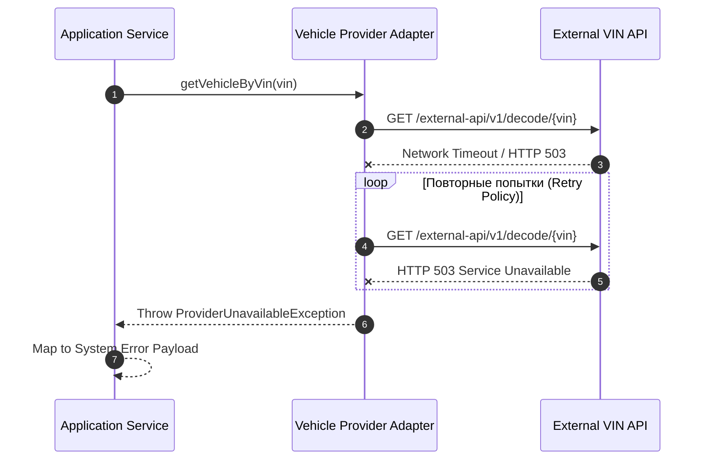

---

## 10. Границы и трансформация DTO

Для изоляции доменных моделей от изменений API и СУБД используется поэтапная трансформация объектов:

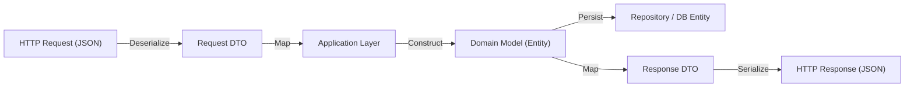

---

## 11. Спецификация контрактов DTO (Data Transfer Objects)

### 11.1. VehicleLookupRequest

```json
{
  "vin": "XTA21070001234567"
}

```

### 11.2. VehiclePreviewResponse

```json
{
  "previewId": "8f2a1b94-3c4d-4e5f-a6b7-8c9d0e1f2a3b",
  "vin": "XTA21070001234567",
  "brand": "LADA",
  "model": "2107",
  "productionYear": 2010,
  "engineCapacity": 1.6,
  "transmission": "MANUAL",
  "expiresAt": "2026-08-07T13:30:00Z"
}

```

### 11.3. CreateVehicleRequest

```json
{
  "previewId": "8f2a1b94-3c4d-4e5f-a6b7-8c9d0e1f2a3b",
  "licensePlate": "А000АА177",
  "currentColor": "Черный"
}

```

---

## 12. Интерфейс репозитория (Repository Contract)

```typescript
interface IVehicleRepository {
  findById(id: string): Promise<VehicleEntity null |>;
  findByVin(vin: string): Promise<VehicleEntity null |>;
  findByUserId(userId: string): Promise<VehicleEntity[]>;
  existsByUserIdAndVin(userId: string, vin: string): Promise<boolean>;
  save(vehicle: VehicleEntity): Promise<VehicleEntity>;
  update(vehicle: VehicleEntity): Promise<VehicleEntity>;
  delete(id: string): Promise<void>;
  
  // Работа с временными снимками (Previews)
  savePreview(preview: VehiclePreviewEntity): Promise<VehiclePreviewEntity>;
  findPreviewById(previewId: string): Promise<VehiclePreviewEntity null |>;
}

```

---

## 13. Интерфейс поставщика данных (Provider Contract)

```typescript
interface IVehicleDataProvider {
  /**
   * Запрашивает технические характеристики ТС у внешнего провайдера
   * @param vin Нормализованный 17-значный VIN
   * @throws ProviderUnavailableException Если внешнее API недоступно
   */
  getVehicleByVin(vin: string): Promise<ExternalVehicleDataDTO>;
}

```

---

## 14. Реализация паттерна «Адаптер» (Adapter Pattern)

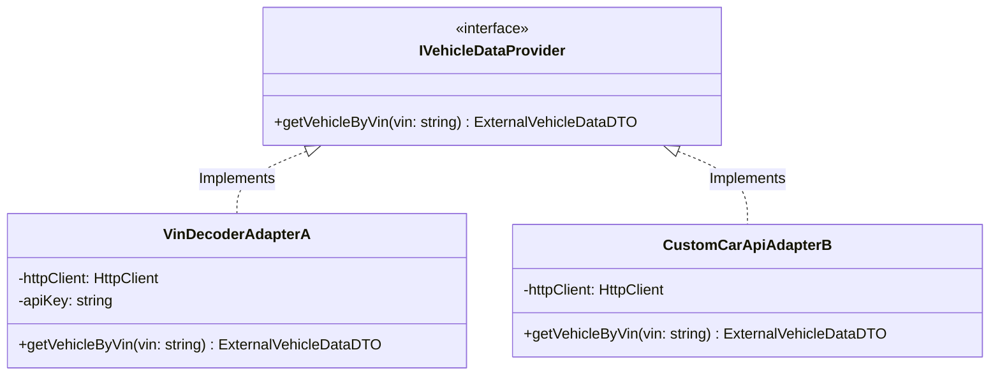

---

## 15. Границы транзакциональности (Transaction Boundary)

Создание автомобиля и очистка промежуточных метаданных выполняются в единой ACID-транзакции на уровне БД.

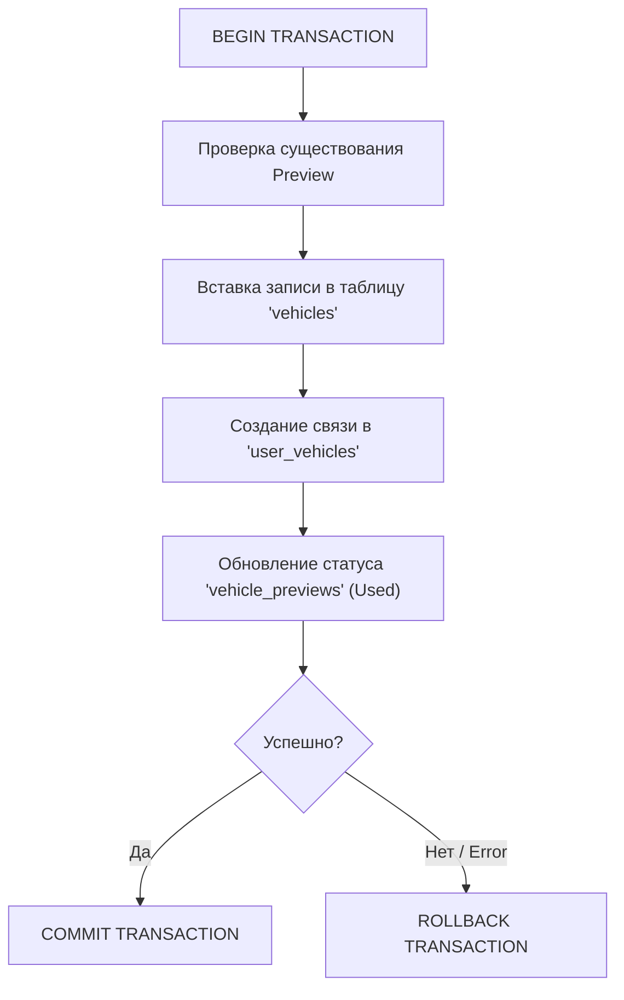

---

## 16. Правила идемпотентности (Idempotency)

1. **Защита от дублирования:** Запрещено создание двух активных автомобилей с одинаковым парами параметров `(UserId + VIN)`.
2. **Повторные запросы:** Повторный вызов метода создания ТС с тем же `previewId` не создает новых записей в БД, а возвращает уже созданный объект `Vehicle` (или ошибку `409 Conflict`).

---

## 17. Обработка конкурентных запросов (Concurrency Considerations)

Для предотвращения состояния гонки (Race Condition) при одновременном нажатии кнопки подтверждения с нескольких устройств:

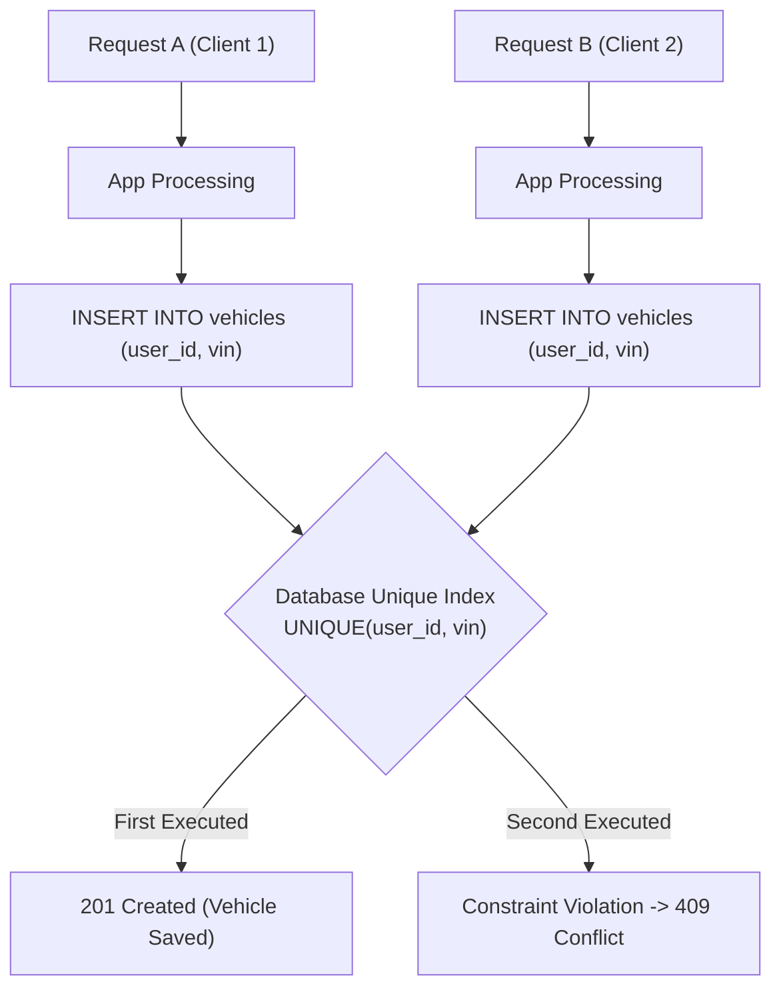

---

## 18. Мониторинг и телеметрия (Observability)

Каждый компонент модуля обогащает контекст выполнения (Log Context) следующими метриками и атрибутами:

| Атрибут | Описание | Применение |
| --- | --- | --- |
| `requestId` | Сквозной UUID HTTP-запроса | Трассировка через Jaeger / Zipkin |
| `userId` | Идентификатор авторизованного пользователя | Анализ действий пользователя |
| `vin` | Маскированный VIN (e.g. `XTA2107****123456`) | Анализ корректности распознавания |
| `providerDurationMs` | Время отклика внешнего API VIN | Мониторинг SLA сторонних провайдеров |
| `dbQueryDurationMs` | Время выполнения SQL-запросов | Оптимизация индексов БД |

---

## 19. Безопасность и авторизация (Security)

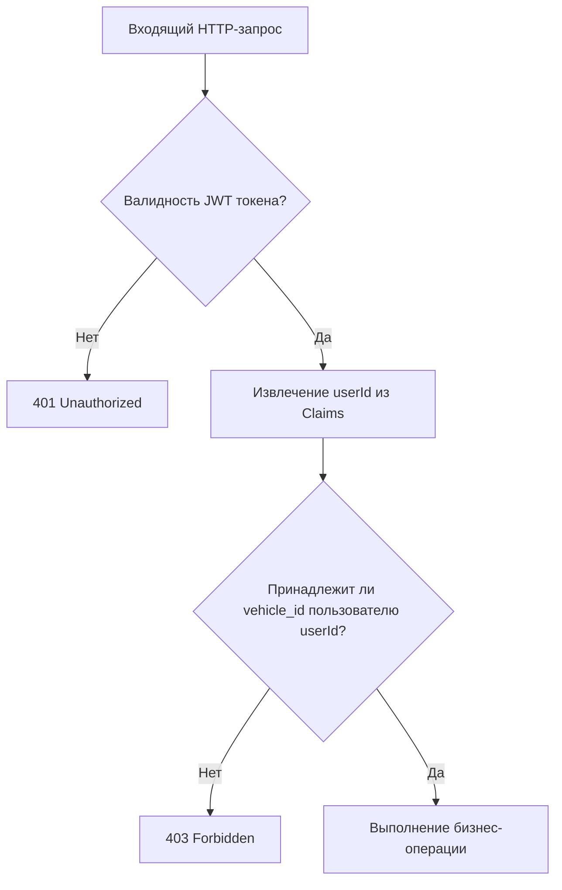

---

## 20. Стратегия тестирования (Testing Strategy)

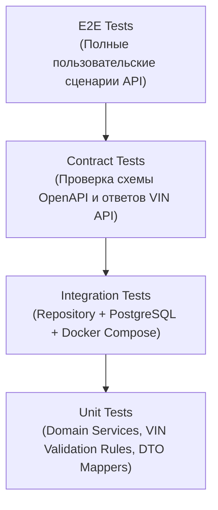

---

## 21. Матрица трассируемости (Traceability Matrix)

| Требование / Use Case | API Endpoint | Компонент модуля | Метод |
| --- | --- | --- | --- |
| **UC-001 (Поиск ТС по VIN)** | `POST /api/v1/vehicles/lookup` | Vehicle Controller -> App Service -> Provider Adapter | `lookupVehicleByVin()` |
| **UC-001 (Подтверждение ТС)** | `POST /api/v1/vehicles` | Vehicle Controller -> App Service -> Repository | `createVehicle()` |
| **UC-002 (Просмотр гаража)** | `GET /api/v1/vehicles` | Vehicle Controller -> App Service -> Repository | `getUserVehicles()` |
| **UC-003 (Удаление ТС)** | `DELETE /api/v1/vehicles/{id}` | Vehicle Controller -> App Service -> Repository | `deleteVehicle()` |

---

## 22. Статус документа

| Параметр | Значение |
| --- | --- |
| **Уровень C4** | C3 — Component Diagram |
| **Модуль** | Vehicle Module |
| **Статус** | Approved |
| **Версия** | 1.0.0 |
| **Авторы** | System Analysis Team |
