Вот полностью проработанный, академичный документ уровня Middle/Senior System Analyst для файла `docs/ru/architecture/c4/c4-container.md`.

Все текстовые ASCII-схемы переведены в **Mermaid-диаграммы**, убраны эмодзи и неформальные выражения, полностью сохранена и расширена вся исходная бизнес-логика, архитектурные ограничения и описания модулей.

---

### Файл: `docs/ru/architecture/c4/c4-container.md`

```markdown
# C4 — Container Diagram (Level 2)

Спецификация контейнерного уровня (C2) архитектурной модели C4 для платформы «Карманный гараж».

---

## 1. Назначение

Документ определяет архитектуру системы на уровне контейнеров (выделенных развертываемых приложений, сервисов и хранилищ данных), распределение функциональных обязанностей между ними и протоколы их сетевого взаимодействия.

В соответствии с методологией C4, под «контейнером» понимается самостоятельно развертываемый исполняемый модуль (executable) или хранилище данных, в рамках которого исполняется код или обрабатываются структуры данных.

---

## 2. Container Diagram

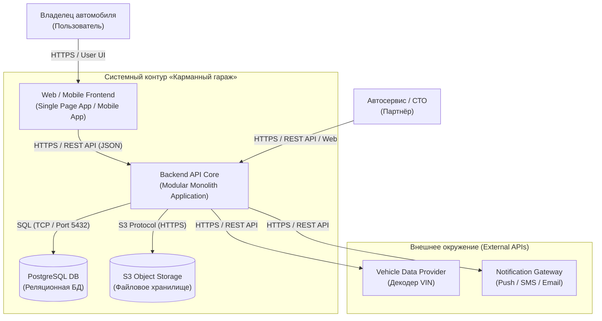

---

## 3. Спецификация контейнеров (Containers Specification)

### 3.1. Web / Mobile Frontend

* **Назначение:** Клиентское приложение, обеспечивающее пользовательский интерфейс взаимодействия с системой.
* **Основной функционал:**
* Аутентификация и управление профилем;
* Ведение виртуального гаража ТС;
* Отображение финансовой аналитики и расходов;
* Просмотр сервисной книжки и истории ТО;
* Поиск, фильтрация СТО на карте и в каталоге;
* Оформление и контроль статуса заявок на сервисное обслуживание;
* Отображение пользовательских уведомлений.


* **Технологический стек (Предварительно):** React / Next.js (Web) или React Native / Cross-platform framework (Mobile).

### 3.2. Backend API Core

* **Назначение:** Ядро системы, исполняющее всю бизнес-логику, оркестрацию данных и обработку транзакций.
* **Основной функционал:**
* Обработка API-запросов и маршрутизация;
* Аутентификация, авторизация и ротация JWT-токенов;
* Серверная валидация входящих данных;
* Исполнение бизнес-правил доменных областей;
* Управление ACID-транзакциями в БД;
* Интеграция с внешними сервисами через слои адаптеров;
* Логирование, аудит и формирование системных ошибок.


* **Архитектура:** Модульный монолит (Modular Monolith).

### 3.3. PostgreSQL Database

* **Назначение:** Единая реляционная СУБД для надежного хранения структурированных данных.
* **Хранимые сущности:**
* Учетные записи пользователей, роли, сессии (`User`);
* Автомобили и профили ТС (`Vehicle`);
* Кэшированные метаданные предпросмотра ТС (`Vehicle Preview`);
* Транзакции финансовых расходов (`Expense`);
* Сервисные записи и история обслуживания (`Maintenance Record`);
* Реестр СТО, прайс-листы и гео-данные (`Service`);
* Заявки на бронирование (`Booking`).


### 3.4. S3 Object Storage

* **Назначение:** Распределенное хранилище неструктурированных бинарных файлов.
* **Хранимые объекты:** Фотографии ТС, сканы чеков, заказ-наряды, акты выполненных работ, аватары пользователей.
* **Правило работы:** В базе данных PostgreSQL сохраняются исключительно строковые URI и UUID метаданные файлов, сами бинарные файлы передаются и хранятся в S3.

### 3.5. Vehicle Data Provider (External)

* **Назначение:** Внешний поставщик справочных автомобильных данных.
* **Предмет интеграции:** Получение технических характеристик ТС по 17-значному VIN-коду.

### 3.6. Notification Provider (External)

* **Назначение:** Внешний агрегатор транспортной доставки сообщений.
* **Каналы связи:** Push-уведомления (приоритет в MVP), SMS-сообщения, Email-рассылки, Telegram Bot API.

### 3.7. Автосервис / СТО (External Actor)

* **Назначение:** Внешний бизнес-пользователь системы.
* **Функционал:** Получение уведомлений о новых бронированиях, подтверждение/отклонение времени приема, актуализация прайс-листа и перечня оказываемых услуг.

---

## 4. Логическая декомпозиция монолита (Backend Modules)

Исходный код Backend API логически инкапсулирован в изолированные модули в рамках единой кодовой базы:

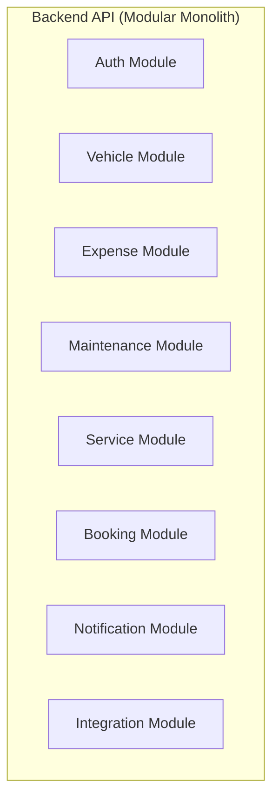

---

## 5. Ответственность бизнес-модулей (Module Responsibilities)

* **Auth Module:** Регистрация, аутентификация (JWT/OAuth2), ротация токенов, управление сессиями, проверка прав доступа (RBAC/ABAC).
* **Vehicle Module:** Управление объектами ТС, обработка VIN-запросов, формирование превью автомобилей, валидация технических параметров.
* **Expense Module:** Фиксация финансовой активности, категориальный учет расходов, генерация аналитических отчетов и статистики TCO.
* **Maintenance Module:** Ведение регламентного и внепланового ТО, фиксирование пробега, детализация выполненных работ и замененных автозапчастей.
* **Service Module:** Ведение каталога автосервисов, гео-поиск, фильтрация по категориям работ, агрегация рейтингов и прайс-листов.
* **Booking Module:** Управление жизненным циклом заявки на ремонт, контроль временных слотов, отмена и перенос визитов.
* **Notification Module:** Формирование событийных уведомлений, очередь отправки, повторные попытки (retry) и отслеживание статусов доставки.
* **Integration Module:** Слой изоляции и адаптеров для взаимодействия с внешними API (Vehicle Data Provider, Notification Provider, Cartography).

---

## 6. Диаграмма межмодульных связей (Backend Module Diagram)

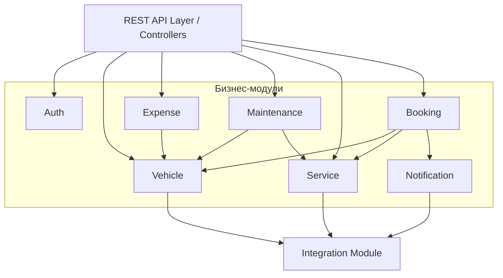

---

## 7. Правила межмодульного взаимодействия (Dependency Rules)

Для предотвращения образования связности («спагетти-кода») установлены следующие архитектурные регламенты:

1. **Изоляция данных:** Модуль не имеет права выполнять прямые SQL-запросы к таблицам БД, принадлежащим другому модулю.
2. **Публичный контракт:** Взаимодействие между модулями осуществляется строго через интерфейсы сервисного слоя (Application Services) или с помощью внутренних доменных событий (Domain Events).
3. **Изоляция контроллеров:** Слой контроллеров не содержит бизнес-логики.

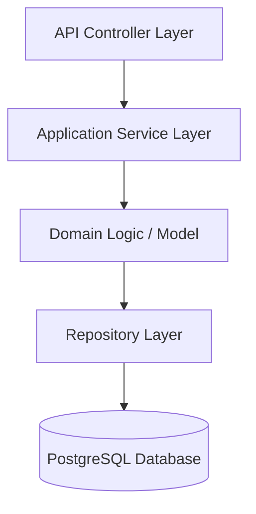

---

## 8. Сценарий взаимодействия: Добавление ТС (Sequence Diagram)

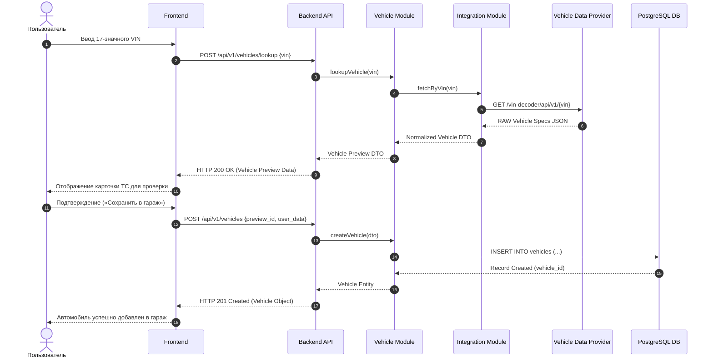

---

## 9. Потоки данных (Data Flows)

### 9.1. Внутренний обработочный поток

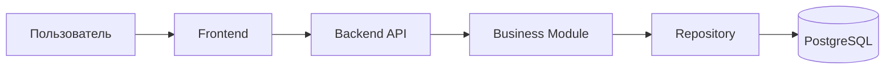

### 9.2. Поток внешних интеграций

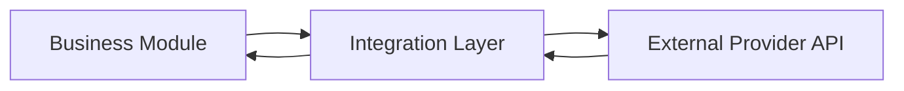

---

## 10. Границы API и изоляция данных (API Boundary)

Прямой доступ клиентских приложений к базе данных полностью запрещен. Доступ осуществляется исключительно через шлюз REST API с обязательной проверкой авторизации и валидацией данных.

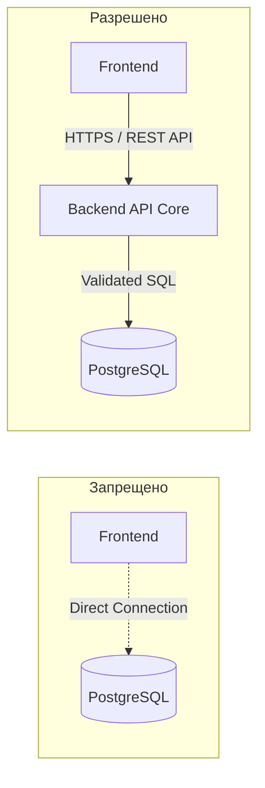

---

## 11. Граница внешних интеграций (External Integration Boundary)

Для исключения жесткой зависимости от API внешних вендоров используется паттерн «Адаптер» (Adapter Pattern). Доменная логика взаимодействует только с абстрактным интерфейсом.

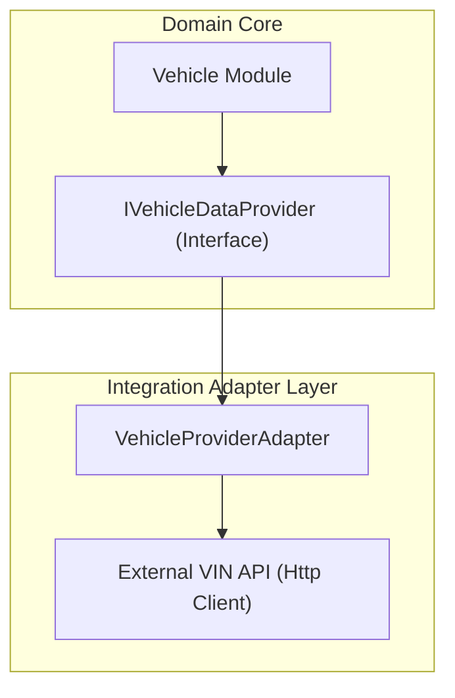

---

## 12. Обработка сбоев и отказоустойчивость (Failure Handling)

При недоступности внешних интеграционных сервисов система сохраняет работоспособность основного контура.

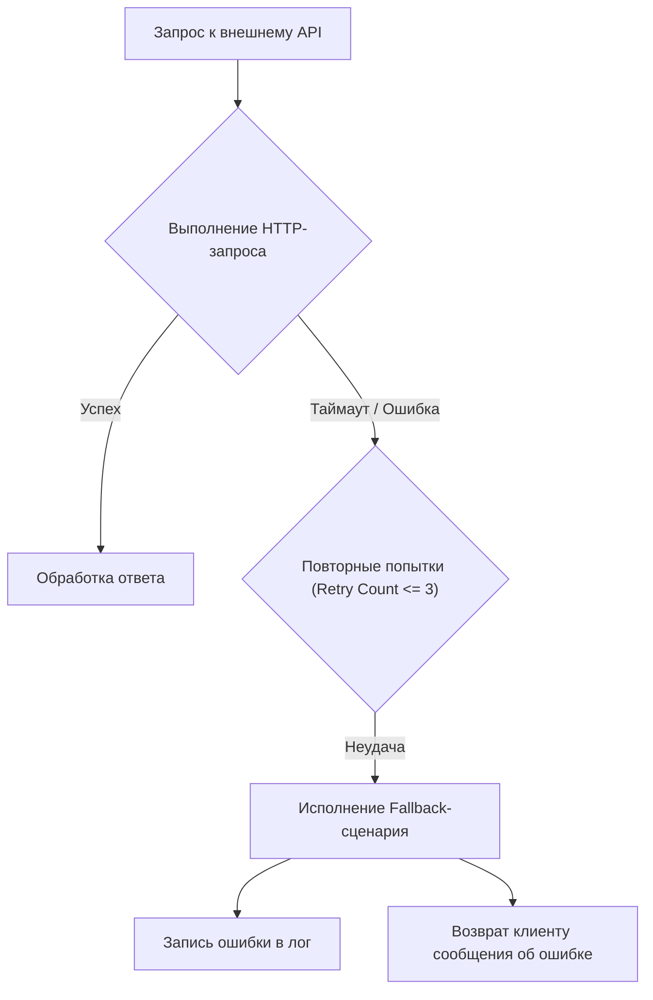

**Формат ответа клиенту при сбое внешнего сервиса:**

```json
{
  "error": {
    "code": "EXTERNAL_PROVIDER_UNAVAILABLE",
    "message": "Сервис расшифровки VIN временно недоступен. Введите данные вручную.",
    "requestId": "a8f3c912-4567-890a-bcde-f0123456789a",
    "timestamp": "2026-08-07T12:30:00Z"
  }
}

```

---

## 13. Требования к доступности (Availability Considerations)

1. **Автономность ядра:** Сбой внешних сервисов (VIN-декодера или Push-шлюза) не должен блокировать просмотр гаража, историю расходов или создание локальных записей ТО.
2. **Circuit Breaker:** Использование тайм-аутов и прерывателей цепи (Circuit Breaker) для предотвращения зависания потоков сервера при долгом отклике сторонних API.

---

## 14. Контур безопасности (Security Boundaries)

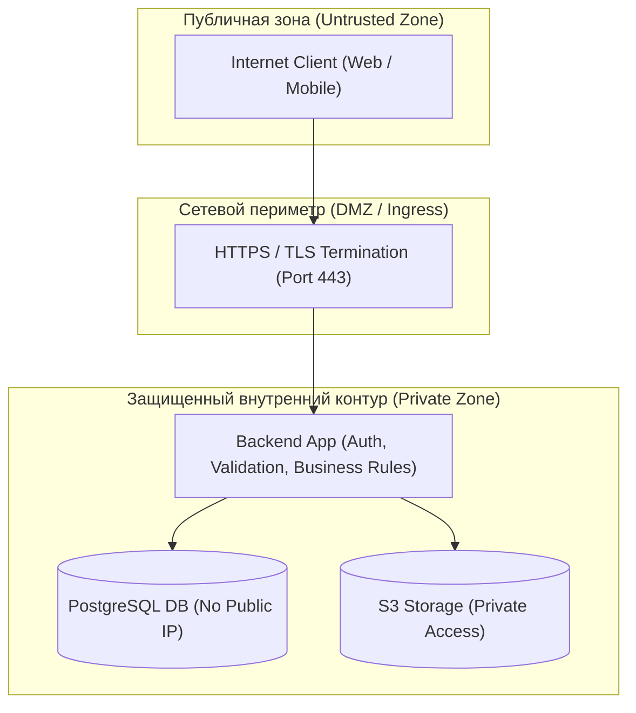

---

## 15. Стратегия масштабирования (Scaling Strategy)

Backend-приложение проектируется в концепции **Stateless** (без сохранения состояния сессии на сервере), что позволяет производить горизонтальное масштабирование путем увеличения количества экземпляров за балансировщиком нагрузки.

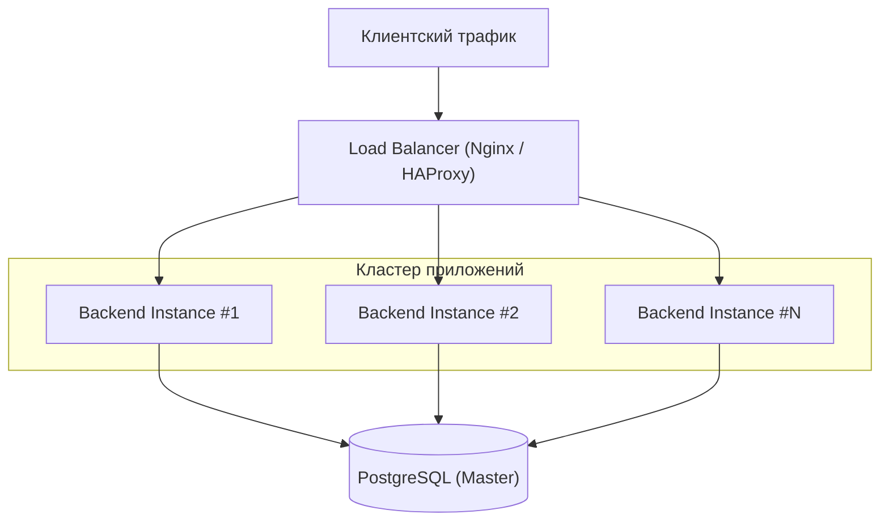

---

## 16. Спецификация технологического стека (Technology Stack)

| Слой системы | Технология / Стандарт | Обоснование выбора |
| --- | --- | --- |
| **Frontend** | React / Next.js (Web), React Native (Mobile) | Высокая скорость разработки, кроссплатформенность |
| **Backend API** | Node.js (TypeScript) / Go / Java | Строгая типизация, высокая производительность, экосистема |
| **Database** | PostgreSQL 15+ | Надежность (ACID), поддержка JSONB и PostGIS (геолокация) |
| **API Protocol** | REST / JSON | Стандарт де-факто, простота интеграции и документирования |
| **Object Storage** | MinIO / S3-compatible | Масштабируемость, совместимость с AWS S3 SDK |
| **Authentication** | JWT (RS256) / OAuth2 | Stateless-аутентификация, удобная масштабируемость |
| **Documentation** | OpenAPI 3.0 (Swagger) | Автоматическая генерация клиентских SDK и контрактов |
| **Diagrams** | Mermaid.js | Кодовая декларация диаграмм в Markdown (Git-native) |
| **Containerization** | Docker, Docker Compose | Изоляция окружения, воспроизводимость сборок |
| **CI/CD** | GitHub Actions | Автоматизация проверок, линтинга и деплоя |

---

## 17. Архитектурные компромиссы (Architecture Trade-offs)

### Модульный монолит vs Микросервисы

* **Выбранное решение:** Модульный монолит (Modular Monolith).
* **Причина выбора:** Скорость валидации продуктовых гипотез MVP, отсутствие высокой нагрузки на старте, минимальная стоимость инфраструктуры и поддержки.
* **Преимущества:**
* Высокая скорость разработки и поставки фичей;
* Простой процесс локальной разработки и деплоя;
* Отсутствие сетевых задержек (network latency) при межмодульном взаимодействии;
* Простая организация транзакций в рамках одной БД.


* **Компромиссы / Риски:**
* Масштабирование происходит только целиком для всего приложения;
* Требуется жесткий контроль архитектурных границ кода для предотвращения высокой связности.


---

## 18. Целевая эволюция архитектуры (Future Evolution)

При достижении пороговых нагрузок или изменении структуры команд монолит может быть декомпозирован на независимые микросервисы без переписывания бизнес-логики:

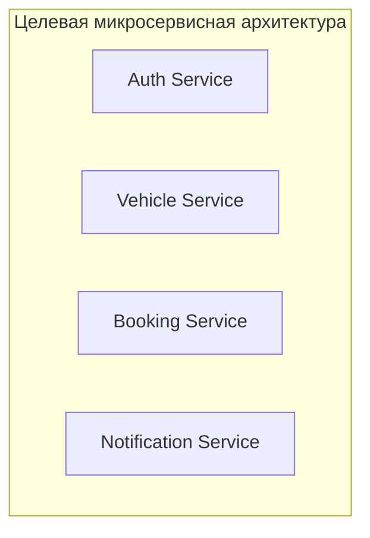

---

## 19. Статус документа

| Параметр | Значение |
| --- | --- |
| **Уровень C4** | C2 — Container Diagram |
| **Статус** | Approved |
| **Версия** | 1.0.0 |
| **Авторы** | System Analysis Team |

```
