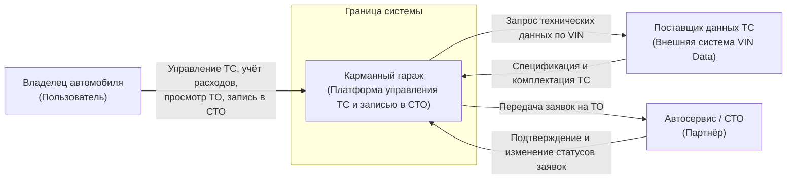
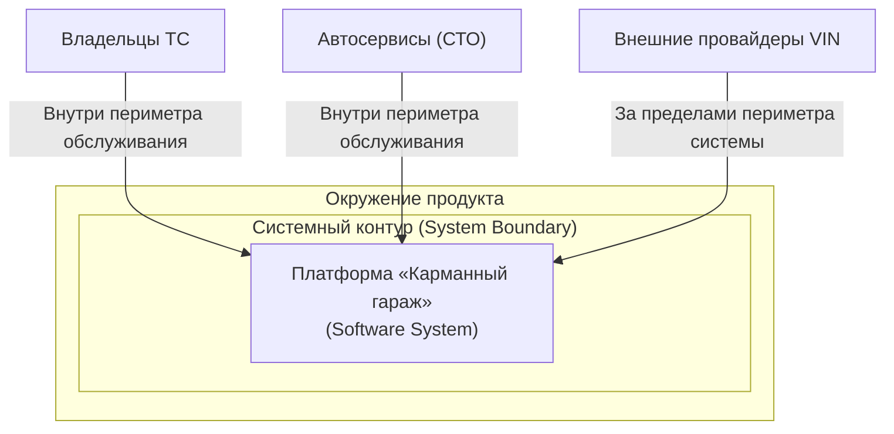

# C4 — System Context 

Спецификация контекстного уровня (C1) архитектурной модели C4 для платформы «Карманный гараж».

---

## 1. Назначение

Контекстная диаграмма фиксирует систему «Карманный гараж» как единый целостный элемент («черный ящик») и определяет границы ее взаимодействия с внешним окружением: пользователями, бизнес-партнерами и сторонними информационными системами.

На данном уровне детализации внутреннее техническое устройство платформы, структура БД и декомпозиция на модули не рассматриваются.

---

## 2. System Context Diagram

---

## 3. Субъекты взаимодействия (Actors)

### 3.1. Владелец автомобиля

Ключевой пользователь платформы.

* **Цели:** Систематизация владения ТС, контроль стоимости владения (TCO), своевременное обслуживание.
* **Функциональные возможности:**
* Добавление и удаление автомобилей в личный гараж;
* Фиксация и категоризация финансовых затрат;
* Просмотр и ведение истории технического обслуживания;
* Поиск партнерских СТО по геопозиции и оказываемым услугам;
* Формирование и отслеживание статуса заявок на сервисное обслуживание.

### 3.2. Автосервис (СТО)

Внешний коммерческий участник экосистемы.

* **Цели:** Привлечение клиентов, загрузка ремзоны, автоматизация приема заявок.
* **Функциональные возможности:**
* Прием и обработка входящих бронирований от владельцев ТС;
* Подтверждение, перенос или отмена визитов;
* Актуализация информации о предоставляемых услугах и их стоимости.

---

## 4. Целевая система (System Under Test)

### Карманный гараж

Центральная программная система, обеспечивающая оркестрацию бизнес-процессов между владельцами ТС, автосервисами и поставщиками справочных данных.

**Базовый функциональный объем:**

* Аутентификация и управление профилем пользователя;
* Модуль ведения виртуального гаража;
* Модуль учета и аналитики расходов;
* Модуль истории ТО и регламентных работ;
* Каталог СТО и реестр предоставляемых услуг;
* Сервис подбора времени и оформления заявок на обслуживание.

---

## 5. Внешние системы (External Systems)

### 5.1. Поставщик данных автомобиля (Vehicle Data Provider)

Внешняя информационная система (декодер VIN).

* **Назначение:** Автоматическое заполнение характеристик ТС (марка, модель, год выпуска, модификация двигателя, тип трансмиссии) по переданному 17-значному идентификатору.
* **Тип интеграции:** REST API / JSON.

### 5.2. Потенциальный контур интеграций (Target Vision / Post-MVP)

Нижеперечисленные системы определены в целевом видении продукта, но исключены из текущего периметра MVP:

* **Payment Gateways:** Провайдеры эквайринга для проведения платежей и предоплаты услуг СТО;
* **Insurance Providers:** Информационные системы страховых компаний для расчета и оформления Е-ОСАГО/КАСКО;
* **Notification Services:** Шлюзы отправки Push (FCM), SMS и Telegram-уведомлений;
* **Geocoding & Maps Provider:** Сервисы картографии для точного геопоиска и построения маршрутов до СТО.

---

## 6. Матрица взаимодействий (Interaction Matrix)

| Инициатор | Целевая система | Предмет взаимодействия | Протокол / Формат |
| --- | --- | --- | --- |
| **Владелец автомобиля** | Карманный гараж | Передача команд управления ТС, внесение расходов, создание заявок | HTTPS / REST (JSON) |
| **Карманный гараж** | Поставщик данных ТС | Запрос расшифровки VIN-кода при добавлении ТС | HTTPS / REST (JSON) |
| **Поставщик данных ТС** | Карманный гараж | Возврат структурированной спецификации автомобиля | HTTPS / REST (JSON) |
| **Карманный гараж** | Автосервис | Передача параметров созданной заявки на бронирование | HTTPS / REST / Webhook |
| **Автосервис** | Карманный гараж | Обновление статуса заявки (Confirmed, Cancelled, Completed) | HTTPS / REST (JSON) |

---

## 7. Границы функционального объема (Scope Boundaries)

### 7.1. Входит в MVP (In Scope)

* Регистрация и аутентификация пользователей;
* Ведение профиля ТС с возможностью автозаполнения по VIN;
* Ручной ввод и категоризация расходов;
* Ведение записей о пройденных ТО;
* Поиск СТО в каталоге с фильтрацией по параметрам;
* Создание и управление жизненным циклом заявки на обслуживание.

### 7.2. Исключено из MVP (Out of Scope)

* Оформление и пролонгация страховых полисов;
* Онлайн-оплата услуг внутри приложения;
* Маркетплейс и продажа автомобильных запчастей;
* Социальное взаимодействие, форумы и отзывы пользователей;
* Интеллектуальный ассистент на базе ИИ;
* Модуль экстренной помощи на дорогах (SOS).

---

## 8. Архитектурный контур (Architectural Boundary)

## 8. Архитектурный контур (Architectural Boundary)

---

## 9. Статус документа

| Параметр | Значение |
| --- | --- |
| **Уровень C4** | C1 — System Context |
| **Статус** | Approved |
| **Версия** | 1.0.0 |
| **Авторы** | System Analysis Team |
