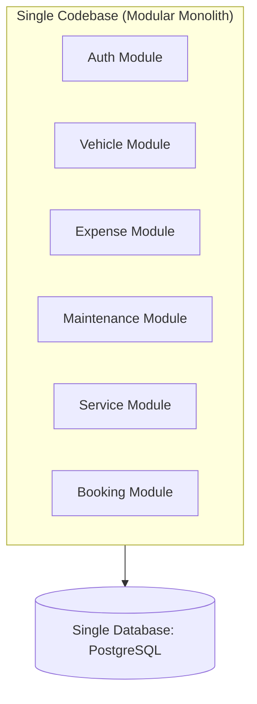
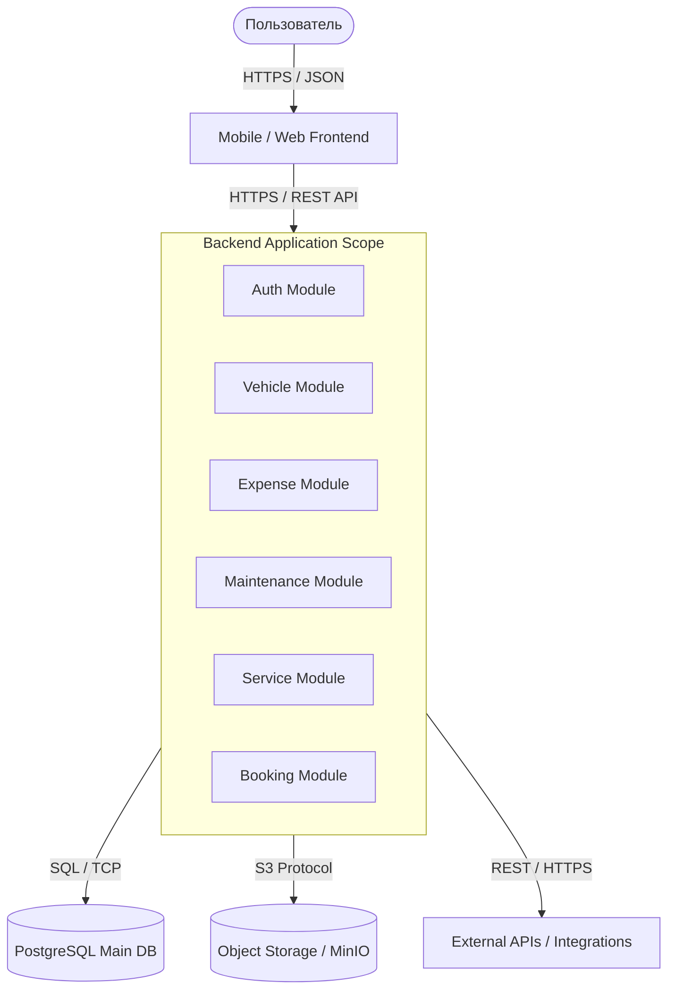
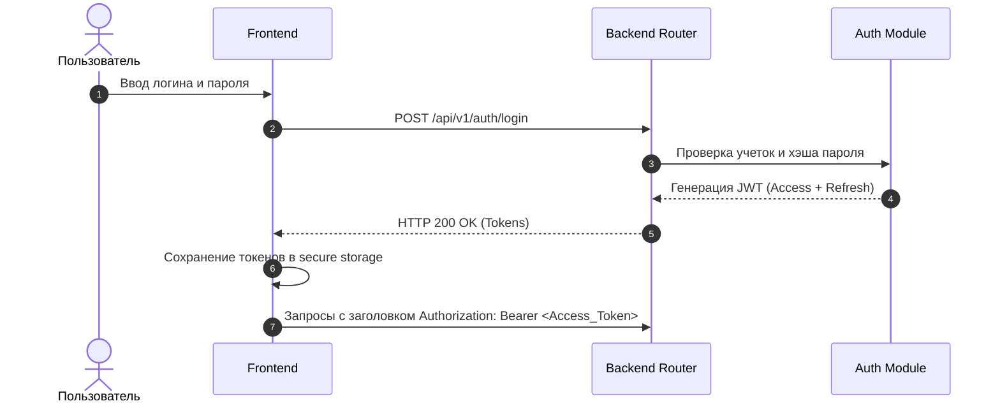
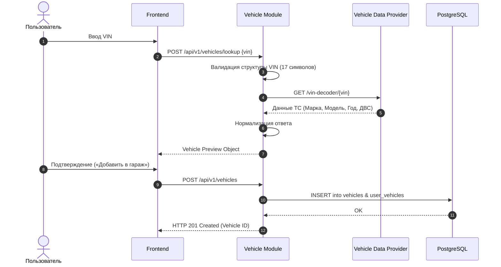
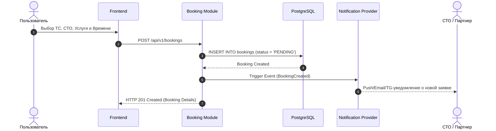
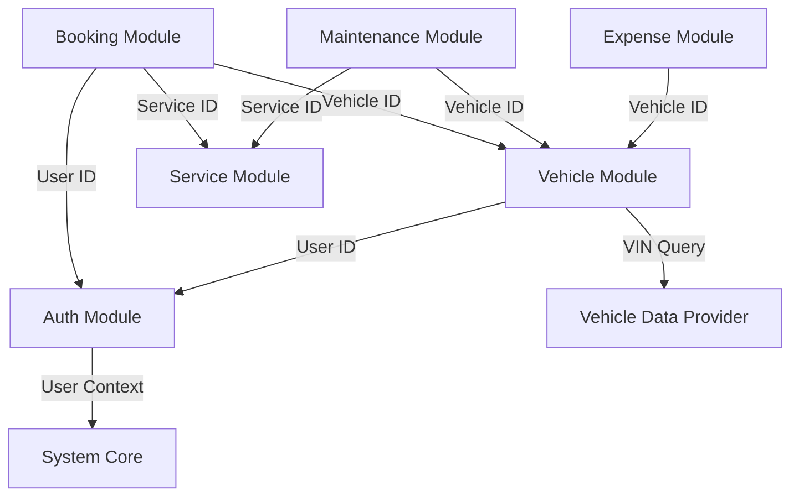
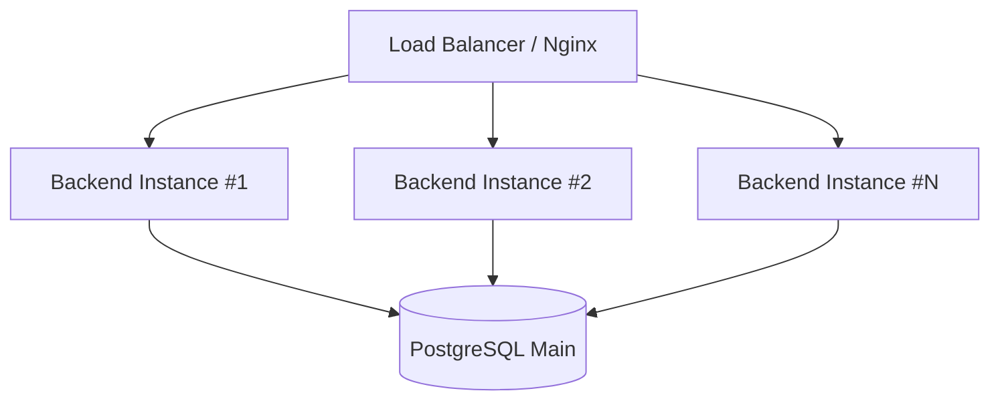

# System Architecture — Карманный гараж

> Спецификация системной архитектуры MVP-версии платформы «Карманный гараж».

---

## 1. Назначение

Документ описывает архитектуру MVP платформы «Карманный гараж», ключевые компоненты системы, внешние интеграционные контуры, границы ответственности сервисов и принципы их взаимодействия.

Архитектура спроектирована с учетом жестких ограничений MVP-скопа и возможностью бесшовного горизонтального масштабирования и распила на микросервисы при росте нагрузки.

---

## 2. Архитектурный подход

Для MVP выбран паттерн **Модульный монолит (Modular Monolith)** с чётким логическим и изолированным разделением на бизнес-модули внутри единой кодовой базы.

---

## 3. Обоснование выбора Modular Monolith

На этапе запуска выделение системы в независимые микросервисы избыточно. Микросервисная архитектура на данном этапе привела бы к:

* Избыточной сетевой связности и задержкам (network latency);
* Необходимости внедрения Service Discovery и Distributed Tracing;
* Появлению дополнительных точек отказа (SPOF);
* Усложнению процессов сборки, деплоя и CI/CD;
* Существенному росту DevOps-затрат и стоимости инфраструктуры.

В MVP отсутствует нагрузка, оправдывающая подобную инженерную сложность.



---

## 4. Архитектурные принципы

1. **API-first:** Вся функциональность системы проектируется и специфицируется через API (OpenAPI 3.0) до реализации.
2. **Separation of Concerns:** Четкая изоляция слоев (API Layer → Service Layer → Data Access Layer).
3. **Модульность:** Каждая доменная область изолирована в рамках своего пакета/модуля.
4. **Централизация бизнес-логики:** Клиентские приложения (Frontend/Mobile) не содержат бизнес-правил, а выступают тонким клиентом.
5. **Низкая связность (Low Coupling):** Модули взаимодействуют между собой через четко определенные внутренние контракты/интерфейсы.
6. **Защита пользовательских данных:** Избыточные и чувствительные данные не передаются на клиент и зашифрованы в БД.
7. **Идемпотентность:** Критичные операции (создание бронирований, проведение платежей) идемпотентны.
8. **Наблюдаемость (Observability):** Сквозное логирование и сбор метрик с первых релизов.
9. **Готовность к распилу (Microservice Ready):** Границы модулей проектируются с учетом потенциального выделения в отдельные сервисы.
10. **MVP-first:** Приоритет отдается простым и эффективным решениям без овер-инжиниринга.

---

## 5. High-Level Architecture



---

## 6. Компоненты системы

### 6.1. Frontend

Клиентская часть приложения (Web / Mobile).

* Отображение пользовательского UI/UX;
* Клиентская валидация форм и вводов;
* Оркестрация клиентских сценариев;
* Взаимодействие с Backend API по REST;
* Обработка и отображение ошибок системы;
* Прием и обработка Push-уведомлений.

### 6.2. Backend

Основное приложение платформы.

* Аутентификация и авторизация пользователей;
* Исполнение бизнес-логики;
* Серверная валидация данных и бизнес-правил;
* Управление состоянием и БД;
* Взаимодействие с внешними провайдерами и сервисами;
* Транзакционный менеджмент;
* Логирование и аудит операций.

### 6.3. Auth Module

* Регистрация и аутентификация пользователей;
* Управление пользовательскими сессиями;
* Выдача и валидация Access / Refresh JWT-токенов;
* Восстановление и сброс паролей.

### 6.4. Vehicle Module

* Регистрация и ведение гаража ТС пользователя;
* Декодирование и валидация VIN через внешние сервисы;
* Управление базовыми характеристиками авто;
* Формирование предварительного карточки ТС (Vehicle Preview);
* Получение списков и фильтрация автомобилей.

### 6.5. Expense Module

* Учет и категория расходов (топливо, мойка, штрафы, тюнинг);
* Редактирование и удаление транзакций;
* Категоризация финансовых записей;
* Расчет финансовой статистики и аналитики TCO (Total Cost of Ownership).

### 6.6. Maintenance Module

* Ведение истории технического обслуживания;
* Фиксация сервисных работ и пробега;
* Учет стоимости запчастей и выполненных работ;
* Привязка записей ТО к конкретным авто и СТО.

### 6.7. Service Module

* Реестр и каталог автосервисов (СТО);
* Гео-поиск и фильтрация партнерских СТО;
* Отображение прайс-листов, услуг и рейтингов;
* Карточки автосервисов.

### 6.8. Booking Module

* Создание и управление заявками на запись в СТО;
* Связка ТС, услуги, желаемого времени и конкретного СТО;
* Жизненный цикл заявки (Draft → Created → Confirmed → Completed / Canceled);
* Обработка отмен и переносов визитов.

---

## 7. Data Layer

### PostgreSQL

Основная реляционная СУБД системы. Используется для хранения:

* Учетных записей пользователей и прав доступа;
* Профилей ТС;
* Истории расходов и сервисных книжек;
* Реестра СТО и их прайс-листов;
* Заявок на бронирование;
* Системных метаданных и логов аудита.

---

## 8. Object Storage

Файловое хранилище (S3-совместимое) предназначено для бинарных данных:

* Фотографии ТС;
* Сканы и фото чеков, заказ-нарядов;
* Документы на автомобиль (СТС/ПТС);
* Аватары пользователей и логотипы СТО.

*Примечание: Файлы никогда не хранятся в PostgreSQL. В БД сохраняются исключительно метаданные:*

```json
{
  "file_id": "uuid-v4",
  "object_key": "vehicles/123/photos/car.png",
  "file_name": "car.png",
  "mime_type": "image/png",
  "size": 204800,
  "created_at": "2026-08-07T12:00:00Z"
}

```

---

## 9. Внешние интеграции (External Integrations)

* **Vehicle Data Provider:** Сервисы расшифровки VIN (гибкая адаптация под API ГИБДД / Автокод / Внешние парсеры).
* **Payment Provider (Future):** Эквайринг для оплаты услуг, бронирований и безопасной сделки (не входит в Scope MVP).
* **Insurance Providers (Future):** Расчет и оформление Е-ОСАГО/КАСКО (не входит в Scope MVP).
* **Notification Provider:** Firebase Cloud Messaging (Push), SMS-шлюзы (SMS.ru/TargetSMS), Telegram Bot API.

---

## 10. API Layer

Backend предоставляет унифицированный REST API.

```text
/api/v1/auth
/api/v1/vehicles
/api/v1/expenses
/api/v1/maintenance
/api/v1/services
/api/v1/bookings

```

---

## 11. Authentication Flow



---

## 12. Vehicle Lookup Flow



---

## 13. Booking Flow



---

## 14. Зависимости модулей (Module Dependencies)



---

**Раздел 15:**
```markdown
## 15. Направление зависимостей (Dependency Direction)

Бизнес-модули не имеют права напрямую запрашивать или мутировать таблицы других модулей в БД.

```mermaid
graph LR
    Booking[Booking Module] -->|Вызов внутреннего Service/Interface| Vehicle[Vehicle Module]
    Vehicle -->|Доступ к таблице| DB[(DB Table: vehicles)]
---

## 16. Границы транзакционности (Transaction Boundary)

Атомарные бизнес-операции оборачиваются в базы данных ACID-транзакции.

Пример при создании авто:

```text
BEGIN TRANSACTION;
  1. INSERT INTO vehicles (...);
  2. INSERT INTO user_vehicles (user_id, vehicle_id, role);
COMMIT;

```

При возникновении ошибки на любом шаге производится полный `ROLLBACK`.

---

## 17. Обработка ошибок (Error Handling)

Система отдает клиенту строго унифицированный JSON-формат ошибок без раскрытия внутренних стэк-трейсов (Security Best Practice).

```json
{
  "error": {
    "code": "VEHICLE_NOT_FOUND",
    "message": "Не удалось найти автомобиль с указанным ID.",
    "requestId": "c4a7e8b9-1234-5678-90ab-cdef12345678",
    "timestamp": "2026-08-07T12:15:30Z"
  }
}

```

---

## 18. Наблюдаемость (Observability)

### Logging

Логирование ведется в структурированном JSON-формате (stdout).

* Ошибки уровня `ERROR` и `CRITICAL`;
* Ответы внешних API и таймауты;
* Аудит изменений прав и финансовые операции;
* События аутентификации.

### Metrics

Предполагаемый сбор Prometheus-метрик:

* `http_requests_total`
* `http_request_duration_seconds`
* `vehicle_lookup_success_rate`
* `booking_creation_total`

### Correlation ID

Каждый входящий HTTP-запрос маркируется заголовком `X-Request-ID`, который пробрасывается сквозь все слои и логи для обеспечения сквозного трейсинга.

---

## 19. Безопасность (Security)

* **Authentication:** Пара токенов `Access Token` (short-lived, 15 мин) + `Refresh Token` (long-lived, 30 дней) с механизмом ротации.
* **Authorization:** Ролевая модель (RBAC / ABAC) с обязательной проверкой владения ресурсом (`user_id == vehicle.owner_id`).
* **Data Protection:** Использование TLS/HTTPS для всех внешних коммуникаций; хэширование паролей с помощью Argon2id / bcrypt.

---

## 20. Масштабируемость (Scalability)

При росте нагрузки платформа горизонтально масштабируется путем запуск нескольких экземпляров бекенда за Load Balancer'ом (Backend проектируется как **Stateless**).



---

## 21. Эволюция архитектуры (Future Evolution)

При достижении высокого уровня нагрузки любой из модулей может быть безболезненно вырезан из монолита в самостоятельный микросервис благодаря изолированным границам.

```text
[ Modular Monolith ] ──(Выделение вызовов в gRPC/Kafka)──> [ Standalone Vehicle Microservice ]

```

---

## 22. Архитектурные решения (ADR)

### ADR-001 — Выбор Modular Monolith для MVP

* **Контекст:** Продукт находится на стадии запуска MVP. Команда разработки компактна, итоговая нагрузка на старте ограничена.
* **Решение:** Использовать архитектурный паттерн Modular Monolith.
* **Причины:**
* Минимальная инфраструктурная сложность;
* Максимальная скорость разработки и проверки гипотез;
* Упрощенное локальное окружение и сборка;
* Единый транзакционный контур;
* Готовая база для будущего распила.


* **Последствия:**
* (+) Высокая скорость поставки фичей, низкая стоимость сервера;
* (-) Требуется строгая дисциплина кода, чтобы не допустить спагетти-связей между модулями.


---

## 23. Ограничения архитектуры (Architecture Constraints)

1. Единое Backend-приложение для MVP;
2. Единая база данных PostgreSQL;
3. Внешние сервисы подключаются исключительно через слой адаптеров (`Integration Layer`);
4. Бинарные файлы не хранятся в БД;
5. Строгое соблюдение границ модулей.

---

## 24. Матрица рисков (Architecture Risks)

| Риск | Влияние | Вероятность | Митигация |
| --- | --- | --- | --- |
| **Резкий рост нагрузки** | Высокое | Средняя | Горизонтальное масштабирование stateless-бекенда |
| **Сбой/недоступность VIN API** | Высокое | Средняя | Кэширование ответов, использование fallback-провайдера |
| **Размытие границ модулей** | Среднее | Средняя | Code Review, статическое тестирование связей (ArchUnit) |
| **Потеря пользовательских файлов** | Высокое | Низкая | Использование S3 с репликацией и версионированием |
| **Проблемы производительности БД** | Высокое | Средняя | Индексация, оптимизация SQL, использование Read Replica |
| **Утечка авторизационных данных** | Критическое | Низкая | Короткоживущие JWT, TLS, аудит безопасности |

---

## 25. Текущий статус (Current Status)

| Область | Статус |
| --- | --- |
| **Architecture Concept** |  Approved (Modular Monolith) |
| **High-Level Architecture** |  Defined |
| **Module Scope** |  Defined |
| **Data Layer** |  Defined (PostgreSQL + S3) |
| **Sequence Diagrams** |  Defined (Mermaid) |
| **ADR-001** |  Accepted |
| **OpenAPI / Contracts** |  In Progress |
