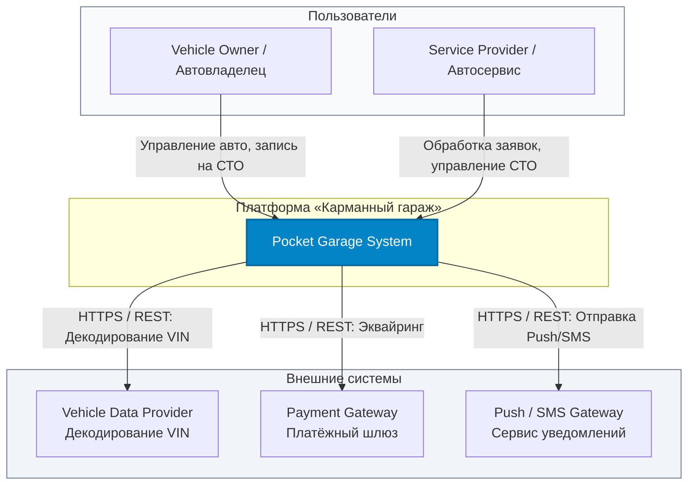
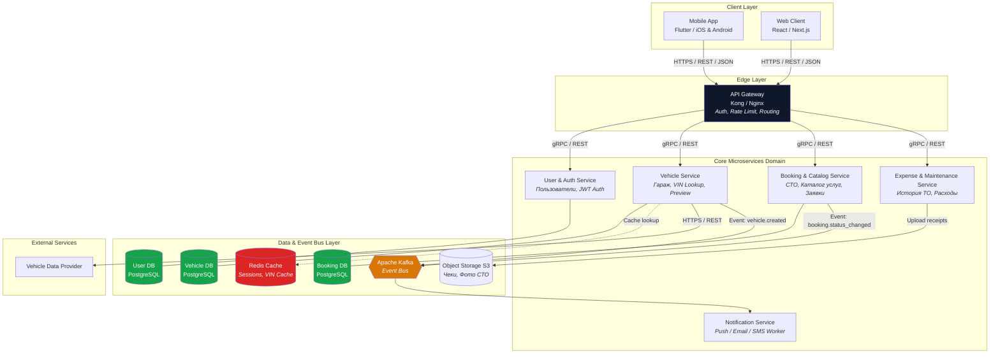

```markdown
# System Architecture — Карманный гараж

> **Паспорт архитектурного документа**
> 
> | Параметр | Значение |
> | :--- | :--- |
> | **Продукт** | Платформа «Карманный гараж» |
> | **Тип документа** | High-Level Architecture (C4 Model) |
> | **Версия** | 1.0 (MVP) |
> | **Стиль архитектуры** | Microservices / Event-Driven Architecture (EDA) |

---

## 1. Назначение и Принципы

Документ описывает верхнеуровневую техническую организацию системы, распределение ответственности между микросервисами, каналы связи, хранилища данных и интеграции с внешними провайдерами.

### Ключевые архитектурные принципы
* **Loose Coupling (Слабая связанность):** Каждый микросервис отвечает за собственную предметную область (Bounded Context) и владеет изолированной БД (Database per Service).
* **Event-Driven Async First:** Длительные и фоновые процессы (уведомления, аналитика) выполняются асинхронно через шину сообщений Apache Kafka.
* **Stateless API Services:** Сервисы не хранят состояние сессий, что позволяет масштабировать их горизонтально.
* **Security in Depth:** Единая точка входа (API Gateway) выполняет проверку JWT, Rate Limiting и защиту приватного контура.

---

## 2. C4 Model — Level 1: Context Diagram

Показывает взаимодействие системы «Карманный гараж» с пользователями и внешними сервисами.



---

## 3. C4 Model — Level 2: Container Diagram

Раскрывает внутреннее устройство системы: клиенты, API Gateway, микросервисы, хранилища данных и асинхронные шины.



---

## 4. Спецификация микросервисов

| Компонент | Зона ответственности | Стек технологий | База данных / Хранилище |
| --- | --- | --- | --- |
| **API Gateway** | Единая точка входа, проксирование, проверка JWT, Rate Limiting | Nginx / Kong / Go | Redis (Rate limits) |
| **User Service** | Регистрация, аутентификация, профили пользователей | Go / Java | PostgreSQL (`users`) |
| **Vehicle Service** | Управление авто, интеграция с провайдером VIN, Preview | Go / Python | PostgreSQL (`vehicles`), Redis |
| **Booking Service** | Каталог СТО, график работы, создание и обработка заявок | Java / Go | PostgreSQL (`bookings`, `services`) |
| **Expense Service** | Учет ТО и расходов, хранение сканов чеков | Node.js / Go | PostgreSQL (`expenses`), S3 / MinIO |
| **Notification Service** | Асинхронная отправка уведомлений (Kafka Consumer) | Go / Python | — |

---

## 5. Асинхронная архитектура (Apache Kafka)

Применяется для ослабления связности сервисов и фоновой обработки событий.

### Ключевые топики Kafka

| Topic Name | Producer | Consumer(s) | Назначение |
| --- | --- | --- | --- |
| `vehicle.created` | Vehicle Service | Notification Service, Analytics | Событие создания авто. Триггерит пуши и аналитику. |
| `booking.created` | Booking Service | Notification Service, Partner Portal | Новая запись на СТО. Уведомляет администратора. |
| `booking.status_changed` | Booking Service | Notification Service | Изменение статуса записи (`CONFIRMED`, `CANCELLED`). |

#### Пример формата события `vehicle.created` (JSON Event Schema)

```json
{
  "eventId": "evt_99a8b7c6-1111-4444-8888-999999999999",
  "eventType": "VEHICLE_CREATED",
  "timestamp": "2026-08-07T12:00:05Z",
  "producer": "vehicle-service",
  "payload": {
    "vehicleId": "veh_01J123456789",
    "userId": "usr_01J987654321",
    "vinMasked": "JTNB********0001",
    "manufacturer": "Toyota",
    "model": "Camry"
  }
}

```

---

## 6. Безопасность и Трассировка

* **Аутентификация:** Выдача `Access Token` (JWT, TTL 15 минут) и `Refresh Token` (Opaque Token, TTL 30 дней).
* **Distributed Tracing:** Заголовок `X-Request-ID` генерируется на API Gateway, пробрасывается во все внутренние вызовы и события Kafka для сквозного логирования.
