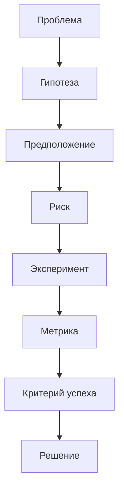
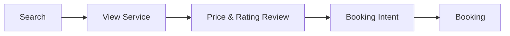
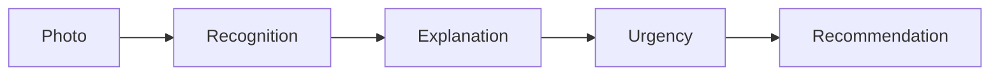
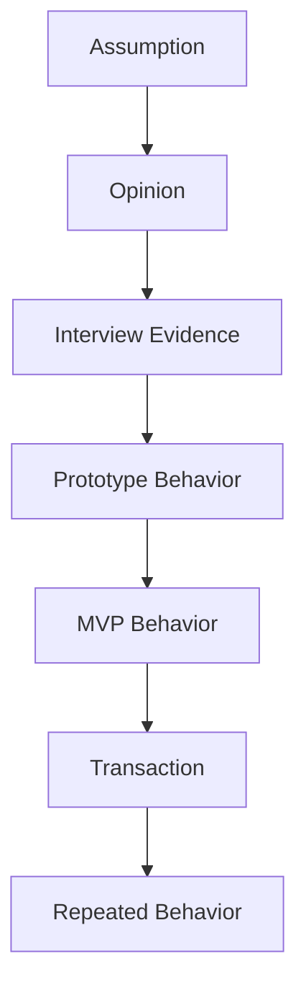

# Product Hypotheses - Продуктовые гипотезы

## 1. Назначение и принципы Discovery

Цель Product Discovery - определить реальные пользовательские проблемы и валидировать продуктовые решения до начала масштабной разработки.

**Главный принцип:** Сначала проверяем проблему и ценность, затем инвестируем в разработку.

---

## 2. Статусы гипотез

| Статус | Значение |
| --- | --- |
| **Backlog** | Гипотеза сформирована, проверка не начата |
| **In Discovery** | Проводится исследование |
| **Validated** | Получены достаточные подтверждения |
| **Invalidated** | Гипотеза не получила подтверждения |
| **Inconclusive** | Данных недостаточно для вывода |
| **Archived** | Гипотеза потеряла актуальность |

---

## 3. Бэклог гипотез

### H01 - Digital Garage (Цифровой профиль)

* **Гипотеза:** Автовладельцы испытывают потребность в едином цифровом профиле автомобиля, где хранятся данные, история обслуживания и расходы.
* **Проблема:** Информация об авто хранитится фрагментарно (в заметочниках, бардачке, разных сервисах).
* **Предположение:** Пользователь готов внести и хранить данные автомобиля в одном приложении.
* **Риск:** Пользователь не увидит достаточной ценности для переноса информации.
* **Эксперимент:** CustDev-интервью + тестирование прототипа.
* **Вопросы для интервью:**
1. Где вы сейчас храните историю обслуживания?
2. Какие именно данные фиксируете?
3. Как часто требуется эта информация?
4. С какими проблемами сталкиваетесь при поиске старых данных?
5. Был бы полезен единый профиль автомобиля?

* **Метрики:** % пользователей с проблемой хранения; % использующих несколько источников; % выразивших интерес к профилю.
* **Критерии успеха:** Большинство респондентов хранят данные в разных местах, испытывают неудобства при поиске и видят ценность в едином профиле.
* **Статус:** Backlog

### H02 — Maintenance Reminders (Напоминания о ТО)

* **Гипотеза:** Автоматические напоминания о плановом обслуживании имеют практическую ценность для автовладельцев.
* **Проблема:** Пользователь забывает о сроках планового ТО и замене расходников.
* **Предположение:** Пользователь хочет получать автоматические сервисные рекомендации.
* **Риск:** Напоминания будут восприниматься как навязчивый спам.
* **Эксперимент:** Прототип + MVP.
* **Метрики:** Reminder Activation Rate, Reminder Open Rate, Reminder Completion Rate, D30 Retention.
* **Критерии успеха:** Пользователи активно создают напоминания, реагируют на них и отмечают выполненные действия.
* **Статус:** Backlog

### H03 - Service Marketplace (Маркетплейс СТО)

* **Гипотеза:** Пользователи готовы искать и выбирать СТО через единый маркетплейс.
* **Проблема:** Поиск СТО требует использования нескольких сторонних источников и обзвонов.
* **Предположение:** Пользователь доверяет агрегированной информации о сервисах.
* **Риск:** Предпочтение отдаётся знакомым сервисам или рекомендациям друзей.
* **Эксперимент:** Concierge MVP (поиск и запись обрабатываются вручную).

* **Метрики:** Conversion (Search → View), Conversion (View → Booking Intent), Booking Completion Rate, Repeat Booking Rate.
* **Критерии успеха:** Стабильный переход пользователей от поиска к намерению записаться.
* **Статус:** Backlog

### H04 - Transparent Pricing (Прозрачные цены)

* **Гипотеза:** Прозрачная стоимость типовых работ повышает доверие к выбору СТО.
* **Проблема:** Пользователь не понимает итоговую стоимость работ до обращения в сервис.
* **Предположение:** Цена является одним из определяющих факторов выбора.
* **Эксперимент:** A/B-тест прототипа:
* **Вариант A:** Карточка СТО без цен.
* **Вариант B:** Карточка СТО с ориентировочной стоимостью типовых работ.

* **Метрики:** CTR, Booking Intent, Booking Conversion, Time to Decision.
* **Критерии успеха:** Вариант с прозрачной ценой показывает более высокую конверсию в запись.
* **Статус:** Backlog

### H05 - VIN Parts Search (Подбор деталей по VIN)

* **Гипотеза:** Автоматический подбор запчастей по VIN снижает ошибки при выборе и сокращает время поиска.
* **Проблема:** Сложность самостоятельного определения совместимости деталей под модификацию авто.
* **Предположение:** Пользователю трудно подбирать детали вручную.
* **Риск:** Ошибки или неполнота данных в VIN-каталогах.
* **Эксперимент:** Прототип подбора.

* **Метрики:** Search Completion Rate, Search Time, Zero-result Rate, Product CTR, Purchase Conversion.
* **Критерии успеха:** Пользователь получает релевантный список деталей быстрее, чем при ручном поиске.
* **Статус:** Backlog

### H06 - AI Dashboard Assistant (Экспресс-диагностика)

* **Гипотеза:** Пользователю требуется быстрое и понятное объяснение неизвестных индикаторов на приборной панели.
* **Проблема:** Водитель не понимает значение предупреждающего значка и степень опасности.
* **Предположение:** Фотографии индикатора достаточно для первичного информирования.
* **Риск / Ограничение безопасности:** Ошибки распознавания AI. Сервис не заменяет профессиональную диагностику.
* **Обязательный состав ответа:** Описание значка + Возможные причины + Оценка срочности + Рекомендованное действие + Дисклеймер.
* **Эксперимент:** Тестирование прототипа.

* **Метрики:** Recognition Success Rate, Feature Adoption, User Satisfaction, Recommendation Acceptance, Service Search Conversion.
* **Критерии успеха:** Пользователь понимает смысл значка, срочность и рекомендуемый следующий шаг.
* **Статус:** Backlog

### H07 - AI → Service Conversion (Конверсия из AI в запись)

* **Гипотеза:** Пользователь, получивший AI-объяснение ошибки, с большей вероятностью запишется в СТО через приложение.
* **Проблема:** Информирование само по себе не устраняет физическую поломку.
* **Предположение:** После расшифровки ошибки пользователь готов перейти к действию.
* **Эксперимент:** MVP-воронка (AI-распознавание → Объяснение → Срочность → Действие → Поиск СТО → Запись).
* **Метрики:** AI → Service Search, Service Search → Booking, Booking Completion, Time to Action.
* **Критерии успеха:** Измеримый переход пользователей из информационного сценария в транзакционный.
* **Статус:** Backlog

### H08 - Cost Analytics (Аналитика расходов)

* **Гипотеза:** Пользователи хотят видеть полную стоимость владения автомобилем (TCO).
* **Проблема:** Расходы на авто распределены по разным категориям и не учитываются системно.
* **Предположение:** У пользователя нет единого представления о реальной стоимости содержания машины.
* **Эксперимент:** Тестирование прототипа аналитики.
* **Метрики:** Expense Entry Rate, MAU аналитики, Analytics View Frequency, Retention.
* **Критерии успеха:** Пользователи регулярно вносят расходы и возвращаются к экрану аналитики.
* **Статус:** Backlog

### H09 - Community (Локальные сообщества)

* **Гипотеза:** Локальные автомобильные сообщества повышают Retention и создают дополнительную ценность.
* **Проблема:** Водители ищут специфические советы на сторонних форумах и в чатах.
* **Предположение:** Локальный контекст делает информацию более применимой.
* **Эксперимент:** Запуск локального пилотного сообщества в одном регионе.
* **Метрики:** DAU/WAU, Posts per Active User, Comments per Post, Community Retention.
* **Критерии успеха:** Пользователи органически создают и потребляют контент без стимулирования.
* **Статус:** Backlog

### H10 - Online Booking (Онлайн-запись)

* **Гипотеза:** Возможность записаться в СТО онлайн снижает барьер по сравнению с телефонным звонком.
* **Проблема:** Телефонная запись требует времени и синхронизации графика с администратором.
* **Предположение:** Пользователь предпочитает self-service бронирование.
* **Эксперимент:** Concierge MVP.
* **Метрики:** Booking Start Rate, Booking Completion Rate, Drop-off Rate, Time to Booking.
* **Критерии успеха:** Пользователи успешно завершают запись без звонков.
* **Статус:** Backlog

### H11 - Vehicle History (История обслуживания)

* **Гипотеза:** Ведение единой истории обслуживания увеличивает LTV и долгосрочную ценность продукта.
* **Проблема:** История ремонта хранится фрагментарно и теряется.
* **Предположение:** Пользователь хочет сохранять прозрачную историю автомобиля.
* **Эксперимент:** MVP сервисной книжки.
* **Метрики:** Service Record Creation, Records per Vehicle, MAU раздела, Retention.
* **Критерии успеха:** Пользователь регулярно добавляет записи и возвращается к истории.
* **Статус:** Backlog

### H12 - Freemium (Платные функции)

* **Гипотеза:** Пользователи готовы платить за расширенные функции управления авто.
* **Возможные Премиум-фичи:** Расширенная аналитика, несколько авто в гараже, персональные напоминания, неограниченная история, приоритетная поддержка, AI-диагностика.
* **Эксперимент:** Fake Door Test (тестирование экрана с ценой).
* **Метрики:** Paywall CTR, Trial Conversion, Subscription Conversion, Churn, ARPU.
* **Критерии успеха:** Подтвержденный Willingness to pay (клики по покупке).
* **Статус:** Backlog

---

## 4. Оценка и приоритизация (ICE Matrix)

Формула оценки: $ICE = \text{Impact} \times \text{Confidence} \times \text{Ease}$ (шкала 1–10).

| ID | Гипотеза | Impact | Confidence | Ease | ICE Score | Группа приоритета |
| --- | --- | --- | --- | --- | --- | --- |
| **H02** | Maintenance Reminders | 8 | 6 | 8 | **384** | **P0** |
| **H01** | Digital Garage | 9 | 6 | 7 | **378** | **P0** |
| **H11** | Vehicle History | 8 | 6 | 7 | **336** | **P0** |
| **H08** | Cost Analytics | 7 | 5 | 8 | **280** | **P0** |
| **H04** | Transparent Pricing | 8 | 5 | 6 | **240** | **P1** |
| **H05** | VIN Parts Search | 9 | 5 | 5 | **225** | **P1** |
| **H10** | Online Booking | 9 | 5 | 5 | **225** | **P1** |
| **H03** | Service Marketplace | 10 | 5 | 4 | **200** | **P2** |
| **H06** | AI Assistant | 10 | 4 | 5 | **200** | **P2** |
| **H12** | Freemium | 7 | 3 | 7 | **147** | **P3** |
| **H07** | AI → Service Conversion | 9 | 3 | 5 | **135** | **P2** |
| **H09** | Community | 6 | 3 | 5 | **90** | **P3** |

---

## 5. Критические предположения (Critical Assumptions)

* **A01:** Пользователь готов хранить данные автомобиля в стороннем сервисе.
* **A02:** Пользователь доверяет рекомендациям платформы.
* **A03:** СТО готовы предоставлять актуальные цены на работы.
* **A04:** СТО готовы принимать клиентов через сторонний интерфейс.
* **A05:** VIN-данные подтягиваются с достаточной точностью.
* **A06:** AI корректно и безопасно разъясняет предупреждения на приборной панели.
* **A07:** Пользователь готов переходить от информации к транзакции внутри одного приложения.

> **Самое рискованное предположение (Riskiest Assumption):** Пользователь готов доверить платформе управление ключевыми сценариями владения авто. Если доверие отсутсвует, концепция SuperApp теряет ценность.

---

## 6. Бэклог экспериментов

| Код | Цель | Метод | Приоритет |
| --- | --- | --- | --- |
| **E01** | Проверить реальные боли хранения и поиска СТО | Customer Interviews | **P0** |
| **E02** | Проверить ценность Digital Garage | Figma-прототип | **P0** |
| **E03** | Проверить реакцию на напоминания | Прототип | **P0** |
| **E04** | Проверить спрос на подбор СТО | Concierge MVP | **P0** |
| **E05** | Проверить онлайн-запись | Concierge MVP | **P1** |
| **E06** | Проверить VIN-поиск | Прототип | **P1** |
| **E07** | Проверить AI Assistant | Прототип | **P1** |
| **E08** | Проверить готовность платить (Freemium) | Fake Door Test | **P2** |
| **E09** | Проверить вовлеченность в комьюнити | Локальный пилот | **P2** |

---

## 7. Фреймворк принятия решений

По итогам каждого эксперимента принимается одно из решений:

* **KEEP:** Гипотеза подтверждена, берем в дальнейшую разработку.
* **ITERATE:** Есть признак ценности, но решение требует доработки.
* **PIVOT:** Проблема подтвердилась, но исходный подход не сработал.
* **KILL:** Проблема или решение не получили подтверждения.

**Иерархия убедительности данных:**

Оценивается реальное изменение поведения пользователей (действия, брони, покупки, возвраты), а не поверхностные фидбеки и опросы.
