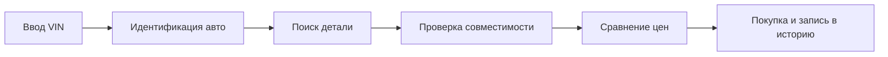
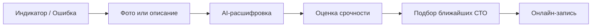

# User Personas - «Карманный гараж»

Рабочие гипотезы пользовательских персон сформированы на основе продуктовых сценариев и фокусируются на поведении, задачах (JTBD) и барьерах пользователей.

---

## 1. Персона P01 - «Алексей» (General Owner)

**Приоритет:** **P0** (Широкий сегмент, частые регулярные сценарии)

### Профиль и контекст

* **Возраст / Опыт:** 31 год, стаж вождения 2–5 лет.
* **Техническая экспертиза:** Средняя / Низкая | **Digital literacy:** Средняя / Высокая.
* **Критерий выбора:** Баланс стоимости, качества и потраченного времени.
* **Контекст:** Использует авто ежедневно (работа, личные поездки, за город). В устройстве машины разбирается базово. При проблемах сначала ищет информацию в интернете, затем идет в сервис.

### Jobs-to-be-Done (JTBD)

* **Functional:** Когда автомобилю требуется обслуживание, я хочу понять, какие работы необходимы и где их сделать, чтобы быстро решить проблему.
* **Emotional:** Я хочу быть уверен, что сервис не навязывает мне лишние услуги и не завышает чеки.
* **Social:** Я хочу знать мнение других автомобилистов перед обращением в незнакомый сервис.

### Поведение и боли

* **Поведение:** Ищет СТО через поисковики и карты, читает отзывы, спрашивает знакомых, сравнивает цены. Редко ведет системную историю обслуживания (чеки и документы хранятся хаотично).
* **Боли (Pain Points):**
* `P01` Не знает точные сроки следующего ТО.
* `P02` Не понимает сложную техническую терминологию.
* `P03` Нет уверенности в необходимости рекомендуемых СТО работ.
* `P04` Сомневается в достоверности отзывов на сторонних площадках.
* `P05` Не хочет тратить время на обзвон нескольких СТО.
* `P06` Боится ошибиться при самостоятельном подборе запчастей.

### Триггеры и барьеры

* **Триггеры:** Приближение ТО, предупреждение на приборке, нестандартный шум/поведение авто, сезонная замена расходников, внезапный крупный расход.
* **Барьеры:** Сложная регистрация с кучей полей, перегруз техническими деталями, рекламный вид рекомендаций, неактуальные цены, непонятная система рейтингов.

### Ключевой сценарий

---

## 2. Персона P02 - «Дмитрий» (DIY Owner)

**Приоритет:** **P1** (Узкий технический сегмент, высокий потенциал для Parts Marketplace)

### Профиль и контекст

* **Возраст / Опыт:** 38 лет, стаж вождения 10+ лет.
* **Техническая экспертиза:** Высокая | **Digital literacy:** Высокая.
* **Критерий выбора:** Качество и точность технической информации + минимальная цена деталей.
* **Контекст:** Отлично разбирается в авто. Часть работ делает сам, сам подбирает запчасти по OEM-номерам, сравнивает производителей и ищет аналоги на форумах. Базовые объяснения ему не нужны.

### Jobs-to-be-Done (JTBD)

* **Functional:** Когда мне нужна запчасть, я хочу быстро найти совместимые варианты по VIN и сравнить цены, чтобы купить деталь по оптимальной цене.
* **Emotional:** Я хочу полностью контролировать процесс обслуживания и не зависеть от решений мастеров.
* **Social:** Я хочу обмениваться техническим опытом с владельцами аналогичных машин.

### Поведение и боли

* **Поведение:** Пользуется специализированными каталогами, знает OEM-номера, ищет детали на форумах, посещает несколько автомагазинов для сравнения цен.
* **Боли (Pain Points):**
* `P01` Долгий и сложный поиск 100% совместимой детали.
* `P02` Необходимость переключаться между несколькими каталогами.
* `P03` Разрозненная и несистемная история ремонтов.
* `P04` Отсутствие единой аналитики стоимости владения (TCO).
* `P05` Необходимость вручную отслеживать регламенты и интервалы.

### Триггеры и барьеры

* **Триггеры:** Поломка, плановое самостоятельно ТО, поиск конкретной детали, желание проверить реальную стоимость ремонта.
* **Барьеры:** Сокрытие технических данных и артикулов, примитивные/упрощенные ответы AI, ошибки в VIN-каталогах, навязывание конкретных продавцов.

### Ключевой сценарий

---

## 3. Персона P03 - «Мария» (Convenience-focused)

**Приоритет:** **P0** (Высокая конверсия в маркетплейс, онлайн-запись и AI-инструменты)

### Профиль и контекст

* **Возраст / Опыт:** 29 лет, стаж вождения 3–7 лет.
* **Техническая экспертиза:** Низкая | **Digital literacy:** Высокая.
* **Критерий выбора:** Удобство, скорость и полное отсутствие необходимости вникать в детали.
* **Контекст:** Активно водит, но устройство машины ей неинтересно. Предпочитает полностью делегировать сервис. Главный вопрос: *«Что случилось и кто это быстро починит?»*

### Jobs-to-be-Done (JTBD)

* **Functional:** Когда возникает проблема с машиной, я хочу получить понятное объяснение и сразу записаться в проверенный сервис без звонков.
* **Emotional:** Я хочу чувствовать себя уверенно и защищенно, даже не разбираясь в технике.

### Поведение и боли

* **Поведение:** Активно использует мобильные приложения, выбирает услуги по отзывам и рейтингам, ценит онлайн-запись, не покупает запчасти сама.
* **Боли (Pain Points):**
* `P01` Непонятный технический жаргон мастеров.
* `P02` Страх обмана и существенной переплаты.
* `P03` Необходимость делать телефонные звонки в СТО.
* `P04` Сложность оценки критичности поломки (можно ли ехать дальше).
* `P05` Трата времени на самостоятельный поиск информации.

### Триггеры и барьеры

* **Триггеры:** Неизвестный индикатор на приборке, подозрительный звук, необходимость ТО или сезонной шиномонтажки, срочная поломка.
* **Барьеры:** Перегруженный интерфейс, много технических терминов, отсутствие прозрачных цен, назойливая реклама.

### Ключевой сценарий

---

## 4. Сравнительная матрица персон

| Атрибут | P01 Алексей | P02 Дмитрий | P03 Мария |
| --- | --- | --- | --- |
| **Техническая экспертиза** | Средняя | Высокая | Низкая |
| **Digital literacy** | Средняя / Высокая | Высокая | Высокая |
| **Чувствительность к цене** | Высокая | Высокая | Средняя |
| **Чувствительность к времени** | Высокая | Средняя | Очень высокая |
| **Зависимость от СТО** | Высокая | Средняя | Очень высокая |
| **Интерес к самостоятельному подбору запчастей** | Средний | Очень высокий | Низкий |
| **Ценность AI-ассистента** | Высокая | Средняя | Очень высокая |
| **Ценность Маркетплейса СТО** | Высокая | Средняя | Очень высокая |
| **Ценность Аналитики расходов** | Высокая | Очень высокая | Средняя |
| **Ценность Сообщества / Форума** | Средняя | Высокая | Низкая |

---

## 5. Маппинг: Персоны → Потребности → Фичи

| Персона | Главная потребность | Ключевой ответ продукта | Ключевые фичи |
| --- | --- | --- | --- |
| **P01 Алексей** | Контроль и доверие | Регламенты ТО + Прозрачный выбор СТО | Digital Garage, Maintenance Reminders, Service Marketplace, Transparent Pricing |
| **P02 Дмитрий** | Технический контроль | Точный подбор деталей + Аналитика | VIN Lookup, Parts Compatibility, OEM Search, Cost Analytics, History |
| **P03 Мария** | Скорость и простота | Экспресс-диагностика + Быстрая запись | AI Assistant, Service Marketplace, Online Booking, SOS |

---

## 6. План и критерии валидации персон

Все персоны являются рабочими гипотезами. Валидация проходит в рамках Customer Discovery через CustDev-интервью, юзабилити-тесты и аналитику MVP.

### Что проверяется:

1. **Поведенческие гипотезы:** Как реальные пользователи выбирают СТО, где хранят историю, как подбирают детали и реагируют на ошибки приборной панели.
2. **Востребованность фичей:** Действительно ли нужны единый Digital Garage, автоматические напоминания и AI-расшифровка.
3. **Готовность к действию (Willingness to use):** Готовы ли пользователи вносить данные авто, доверять рекомендациям и бронировать слоты онлайн.

### Критерии подтверждения персоны:

* Наличие повторяющегося поведенческого паттерна у $\ge 60\%$ респондентов сегмента.
* Подтверждение острой проблемы и неудовлетворенность текущими костыльными решениями (workarounds).
* Выраженная готовность использовать альтернативное решение в виде приложения.
