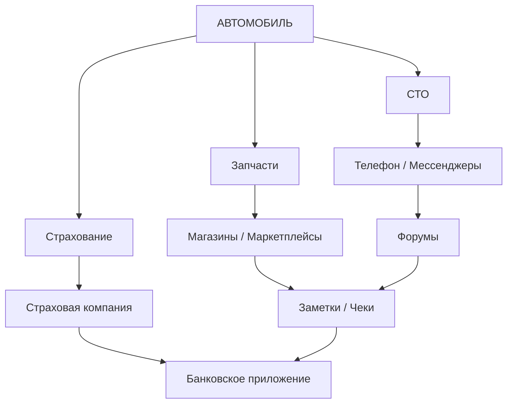
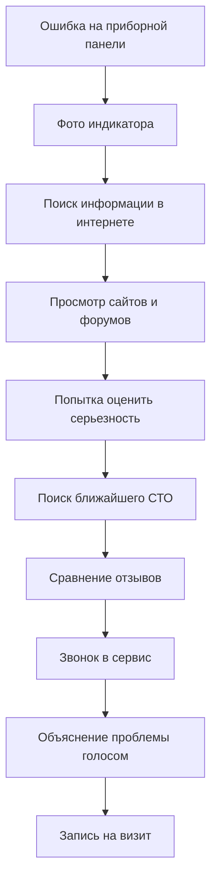
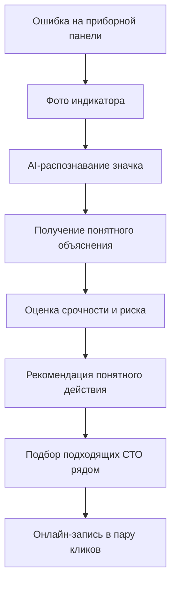
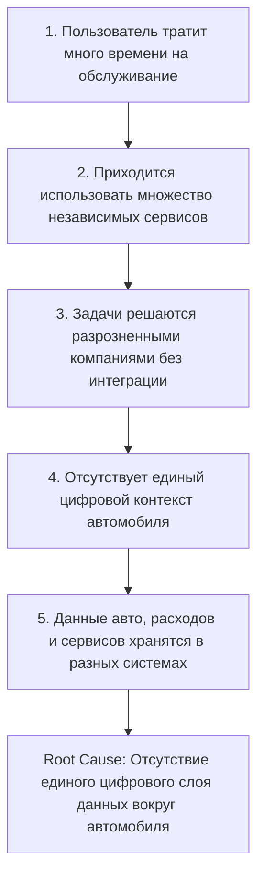
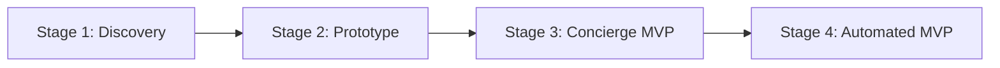
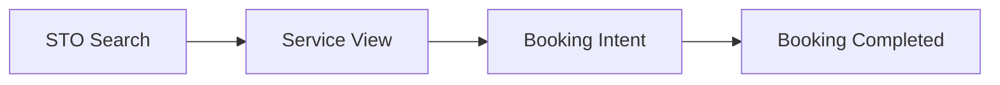
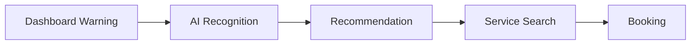

# Problem Statement - Постановка проблемы

Документ фиксирует проблему, которую решает «Карманный гараж», её контекст, участников, текущий пользовательский сценарий и проверяемые гипотезы.

---

## 1. Контекст

Владение автомобилем представляет собой не один пользовательский сценарий, а совокупность регулярно повторяющихся задач: обслуживание, ремонт, покупка расходников, поиск запчастей, контроль расходов, страхование, штрафы, поиск СТО, экстренная помощь и получение технической информации.

Сейчас эти задачи решаются через разрозненные каналы, а пользователь вынужден вручную связывать информацию между ними.

### Текущая фрагментированная модель



*Информация о конкретном автомобиле не является единой связанной сущностью.*

---

## 2. Core Problem (Основная проблема)

> **Ключевая проблема:** Автовладелец вынужден самостоятельно управлять разрозненными данными, сервисами и решениями, поскольку отсутствует единая цифровая система, объединяющая контекст конкретного автомобиля.
> **Последствие:** Пользователь тратит много лишнего времени и нервов на поиск, сравнение и перенос информации между сервисными ресурсами.

---

## 3. Декомпозиция проблемы

### 3.1. Fragmented Information (Фрагментированные данные)

Информация об авто рассыпана по различным источникам: документы, заказ-наряды, приложения, e-mail, мессенджеры, банк, заметки, сайты СТО.

* **Последствие:** Отсутствует единая актуальная история обслуживания.

### 3.2. Maintenance Uncertainty (Неопределенность в ТО)

Пользователь не знает точно: когда следующее ТО, какие расходники менять, какие работы критичны, а какие можно отложить, сколько это будет стоить.

* **Последствие:** Обслуживание происходит реактивно (по факту поломки), а не планово.

### 3.3. Service Selection Problem (Сложность выбора СТО)

Выбор сервиса сопровождается непрозрачными ценами, нестабильным качеством, накрученными отзывами, необходимостью обзвона и отсутствием контекста авто у мастера.

* **Последствие:** Высокий уровень стресса и неопределенности перед визитом в сервис.

### 3.4. Spare Parts Selection Problem (Сложность подбора запчастей)

Подбор деталей зависит от VIN, модификации, двигателя, года, комплектации, OEM-номера и совместимости аналогов.

* **Последствие:** Риск заказать неправильную деталь, потерять время на возврат и переплатить.

### 3.5. Cost Visibility Problem (Отсутствие учета TCO)

Траты размазаны по категориям: топливо, ТО, ремонт, детали, страховка, налоги, мойка, шиномонтаж, парковки.

* **Последствие:** Пользователь не видит реальную стоимость владения машиной (Total Cost of Ownership).

### 3.6. Emergency Information Gap (Информационный вакуум при авариях/ошибках)

При загорании «чека» на панеле пользователь не знает: что значит значок, насколько всё критично, можно ли ехать дальше и нужно ли эвакуироваться.

* **Последствие:** Паника, стресс и риск доломать авто неверным решением.

---

## 4. Current User Journey (AS-IS)

Сценарий решения проблемы при возникновении ошибки на приборной панели сегодня:



### Ключевые Friction Points (Точки трения)

| Этап | Проблема |
| --- | --- |
| **Распознавание ошибки** | Пользователь не знает точного значения индикатора |
| **Поиск информации** | Данные разбросаны по десяткам форумов и статей |
| **Оценка критичности** | Отсутствует учет контекста конкретного авто |
| **Поиск СТО** | Требуется искать отдельно на картах/агрегаторах |
| **Запись** | Почти всегда требуется телефонный звонок |
| **Передача информации** | Пользователь на пальцах объясняет проблему мастеру |

---

## 5. Desired User Journey (TO-BE)

«Карманный гараж» превращает хаотичный поиск в управляемый бесшовный сценарий:



> **Главный сдвиг:** Переход от самостоятельного поиска и гадания к прозрачному, управляемому сценарию принятия решений.

---

## 6. Заинтересованные стороны (Stakeholders)

* **End User (Водитель):** Безопасное, понятное и удобное управление авто без переплат.
* **Service Provider (СТО):** Получение целевых клиентов и предсказуемая загрузка ремзоны.
* **Parts Seller (Автомагазины):** Релевантный трафик и продажи точно подходящих деталей.
* **Insurance Provider (Страховщики):** Целевые лиды на продление Е-ОСАГО и КАСКО.
* **Platform («Карманный гараж»):** Построение устойчивой экосистемы и монетизация транзакций.

---

## 7. Влияние проблемы (Problem Impact)

| Stakeholder | Проблема | Негативный эффект (Impact) |
| --- | --- | --- |
| **Водитель** | Разрозненные сервисы | Потеря времени и лишний стресс |
| **Водитель** | Непрозрачные цены | Риск переплаты и навязывания услуг |
| **Водитель** | Ошибки при подборе деталей | Прямые финансовые потери и простои |
| **Водитель** | Отсутствие единой истории | Сложность контроля авто и потери при продаже |
| **СТО** | Слабый digital-маркетинг | Потеря потенциальных клиентов |
| **Магазин запчастей** | Низкая релевантность трафика | Высокий процент возвратов и низкая конверсия |
| **Платформа** | Нет единого контекста | Сложно построить масштабируемый SuperApp |

---

## 8. Root Cause Analysis (Причинно-следственный анализ)

Метод **5 Whys**:



---

## 9. Jobs-to-be-Done (JTBD)

* **Job 1 (Maintenance):** Когда приближается плановое ТО, я хочу заранее знать объем работ и примерную стоимость, чтобы избежать неожиданных расходов.
* **Job 2 (Service):** Когда нужен автосервис, я хочу сравнить проверенные варианты, чтобы выбрать лучшее соотношение цены, качества и удобства локации.
* **Job 3 (Parts):** Когда нужна запчасть, я хочу автоматически определить совместимые варианты по VIN, чтобы не ошибиться при покупке.
* **Job 4 (Emergency):** Когда на приборке загорается неизвестный значок, я хочу быстро узнать его значение и срочность, чтобы принять безопасное решение.
* **Job 5 (Cost Control):** Когда я анализирую расходы на авто, я хочу видеть их в одном месте, чтобы понимать реальную стоимость владения (TCO).

---

## 10. Фреймворк гипотез (Hypothesis Framework)

| ID | Предположение | Метод проверки | Метрики / Сигнал успеха |
| --- | --- | --- | --- |
| **H1** | Автовладельцам нужен единый цифровой профиль авто | CustDev-интервью + Тест прототипа | Пользователь сам заявляет о боли разрозненного хранения |
| **H2** | Автоматические напоминания о ТО имеют высокую ценность | Интервью + MVP | Reminder creation rate, Interaction rate, D30 Retention |
| **H3** | Пользователи готовы записываться в СТО через агрегатор | Landing Page + Concierge MVP | Search → Booking conversion, Completion rate, Repeat rate |
| **H4** | Подбор запчастей по VIN снижает friction | Прототип «VIN → Совместимые детали» | Search success rate, Product CTR, Purchase conversion |
| **H5** | AI-помощник по значкам — сильный дифференциатор | Тестирование прототипа | Feature adoption, User satisfaction, Conversion to booking |

---

## 11. Факты vs Предположения (Assumptions vs Facts)

| Тип | Утверждение |
| --- | --- |
| **Fact** | Автомобиль требует регулярного обслуживания и затрат. |
| **Fact** | Пользователь вынужден взаимодействовать с разными сервисами. |
| **Assumption** | Пользователь хочет объединить все эти сервисы в одно приложение. |
| **Assumption** | Пользователь доверит сервису хранение истории своего авто. |
| **Assumption** | Пользователи будут записываться в СТО через платформу, а не напрямую. |
| **Assumption** | AI-помощник по ошибкам повысит конверсию в запись в СТО. |
| **Assumption** | Автосервисы готовы платить комиссию за привлеченного клиента. |

---

## 12. План исследований (Research Plan)

До разработки кода необходимо провести **Customer Discovery**:

* **Выборка:** 15–20 глубинное интервью с автовладельцами.
* **Сегментация:**
* 5 начинающих водителей;
* 5 опытных водителей;
* 5 водителей, обслуживающих авто своими руками (DIY);
* 5 водителей, обслуживающихся строго на СТО.


---

## 13. Темы CustDev-интервью

1. **Ownership:** Срок владения, частота поездок, регулярные задачи.
2. **Maintenance:** Как определяется срок ТО, где хранится история, кто принимает решение о ремонте.
3. **Service:** Критерии выбора СТО, сравнение цен, причины недоверия.
4. **Parts:** Опыт покупки запчастей, использование VIN, ошибки при заказе.
5. **Emergency:** Поведение при неизвестных ошибках на приборной панели.
6. **Expenses:** Учет расходов, знание реальной стоимости владения в месяц.

---

## 14. Результаты исследования (Research Outputs)

По итогам исследований формируются:

* Interview Notes & Pain Points Matrix;
* Уточненные User Personas & JTBD;
* Обновленная карта Customer Journey & Opportunity Map;
* Статусы валидации гипотез и обновленный Product Backlog.

---

## 15. Стратегия валидации MVP



1. **Stage 1 — Discovery:** Глубинные интервью для понимания болей.
2. **Stage 2 — Prototype:** Интерактивный Figma-прототип для проверки юзабилити.
3. **Stage 3 — Concierge MVP:** Ручная обработка под капотом (например, оператор вручную подбирает запчасти по VIN после запроса).
4. **Stage 4 — MVP:** Автоматизация только тех сценариев, где подтверждена ценность.

---

## 16. Метрики валидации MVP

### Активация и Удержание

* **Activation Rate:** Зарегистрировался $\rightarrow$ Добавил авто $\rightarrow$ Совершил полезное действие.
* **Retention Rate:** D7 и D30 Retention.

### Конверсия в Запись (Service Conversion)



### Конверсия AI-фичи (AI Conversion)



---

## 17. Problem Statement Summary

* **One-line summary:** Автовладельцам сложно эффективно управлять автомобилем, потому что информация, обслуживание, расходы и сервисы распределены между различными платформами и не связаны единым цифровым контекстом.
* **Product Opportunity:** Создать единый цифровой слой вокруг автомобиля, который объединяет данные, обслуживание, расходы, сервисы и рекомендации, превращая хаотичные действия в удобный единый workflow.

---

## 18. Статус валидации проблемы

Проблема считается **подтвержденной**, если исследование докажет:

1. Проблема возникают регулярно и несёт ощутимые затраты/стресс.
2. Пользователь уже пытается её решать костылями (workarounds).
3. Пользователь готов сменить привычное поведение в пользу приложения.

* **Текущий статус:** `Discovery / Hypothesis stage`
* **Валидация:** `Not completed`
* **Следующий шаг:** `Customer Discovery Interviews`
* **Ответственный:** `Product / System Analysis`

```

```
