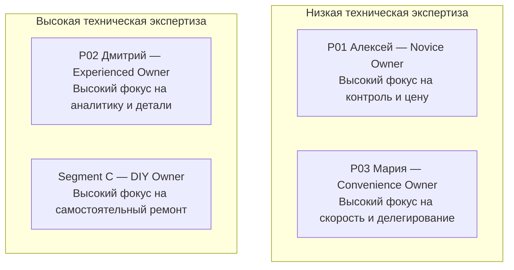

# Target Audience — Целевая аудитория

Документ описывает целевые сегменты продукта «Карманный гараж», их потребности, поведение, контекст использования и приоритет для MVP.

---

## 1. Целевой рынок и ICP

### Целевой рынок (Target Market)
Первоначальный рынок — частные автовладельцы, регулярно использующие автомобиль для повседневных поездок и самостоятельно принимающие решения по его эксплуатации и обслуживанию. 

Запуск предполагается в формате **Local-first** (один регион/город) с последующим масштабированием на федеральный уровень.

### Идеальный профиль клиента (Ideal Customer Profile — ICP)
Автовладелец **25–45 лет**, который регулярно использует автомобиль, самостоятельно принимает решения по его обслуживанию и заинтересован в экономии времени, контроле расходов и сохранении технического состояния авто.

| Параметр | Описание |
| :--- | :--- |
| **Возраст** | 25–45 лет |
| **Владение** | Собственный личный автомобиль |
| **Использование** | Регулярное (ежедневные поездки, работа, быт, выезды) |
| **Digital adoption** | Средний / Высокий |
| **Принятие решений** | Самостоятельно или совместно с семьёй |
| **Чувствительность к цене** | Средняя / Высокая |
| **Ценность времени** | Высокая |
| **Основная потребность** | Контроль состояния авто и снижение friction при обслуживании |

---

## 2. Фреймворк сегментации (Segmentation Framework)

Сегментация строится не на демографии, а на поведенческих и контекстных факторах:
* Опыт владения и техническая компетентность;
* Отношение к обслуживанию (делегирование vs самостоятельный контроль);
* Уровень цифровой грамотности (Digital behavior);
* Частота возникновения автомобильных задач;
* Willingness to pay (готовность платить);
* Уровень доверия к СТО.

---

## 3. Сегменты пользователей

### Segment A — Novice Owner (Начинающий автовладелец)
* **Профиль:** Небольшой опыт самостоятельного обслуживания, недавно приобрёл авто.
* **Характеристики:** Плохо разбирается в технической терминологии, ищет всё в интернете, боится обмана и ошибок при выборе СТО, склонен переоценивать или недооценивать критичность поломок.
* **Jobs (JTBD):** Понять, что сломалось $\rightarrow$ Найти надежный сервис $\rightarrow$ Узнать адекватную цену $\rightarrow$ Избежать навязанных услуг.
* **Боли:** Отсутствие экспертизы, страх переплаты, непонятные прайсы, сложность выбора СТО.
* **Потребности:** Простые объяснения без жаргона, независимые рекомендации, прозрачные цены, напоминания о ТО.
* **Product Opportunity:** **Высокая** (платформа полностью компенсирует недостаток собственных знаний).

### Segment B — Experienced Owner (Опытный автовладелец)
* **Профиль:** Значительный стаж вождения, системно подходит к обслуживанию.
* **Характеристики:** Понимает технические процессы, сравнивает цены, может сам подобрать деталь, пользуется автосообществами.
* **Jobs (JTBD):** Быстро найти проверенную информацию $\rightarrow$ Контролировать процесс $\rightarrow$ Сравнивать альтернативы $\rightarrow$ Экономить время.
* **Боли:** Разрозненная история ремонтов, необходимость использовать 5+ разных приложений и сайтов, ручной контроль сроков.
* **Потребности:** Автоматизация, единая аналитика и история, быстрый поиск деталей, интеграции.
* **Product Opportunity:** **Высокая** (пользователь остро чувствует боль и готов использовать расширенный функционал).

### Segment C — DIY Owner (Самостоятельно обслуживающий)
* **Профиль:** Выполняет часть ремонтных и сервисных работ своими руками.
* **Характеристики:** Глубоко погружен в устройство авто, ищет запчасти по каталогам и форумам, ведет собственные записи.
* **Jobs (JTBD):** Найти 100% совместимую деталь $\rightarrow$ Найти OEM-номер $\rightarrow$ Сравнить цены продавцов $\rightarrow$ Сохранить историю работ.
* **Боли:** Сложный подбор по VIN, разрозненные каталоги магазинов, ручной учет затрат.
* **Product Opportunity:** **Высокая** для модулей *Parts Search* и *Digital Garage*.

### Segment D — Convenience-focused Owner (Ориентированный на удобство)
* **Профиль:** Не хочет вникать в устройство машины. Принцип: *«Хочу отдать авто в нормальный сервис и не тратить время»*.
* **Jobs (JTBD):** Быстро найти хороший сервис $\rightarrow$ Записаться без звонков $\rightarrow$ Получить понятную смету $\rightarrow$ Забрать готовое авто.
* **Боли:** Телефонные звонки, необходимость объяснять проблему на пальцах, отсутствие прозрачных сроков и цен.
* **Product Opportunity:** **Очень высокая** для *Service Marketplace* и *Online Booking*.

### Segment E — EV Owner (Владелец электромобиля)
* **Профиль:** Специфические сценарии эксплуатации и обслуживания.
* **Jobs (JTBD):** Мониторинг здоровья батареи (SoH) $\rightarrow$ Поиск и бронь зарядных станций $\rightarrow$ Специализированный EV-сервис.
* **Product Opportunity:** **Средняя на этапе MVP** / **Высокая при масштабировании**.

---

## 4. Приоритезация сегментов для MVP

Оценка проводится по формуле: 

$$\text{Prioritization Score} = \text{User Pain} \times \text{Frequency} \times \text{Business Value} \times \text{Accessibility}$$

| Сегмент | User Pain | Frequency | Business Value | Приоритет MVP |
| :--- | :---: | :---: | :---: | :---: |
| **Novice Owner (A)** | High | High | High | **P0** |
| **Experienced Owner (B)** | Medium | High | High | **P0** |
| **Convenience-focused Owner (D)** | High | High | Very High | **P0** |
| **DIY Owner (C)** | High | Medium | High | **P1** |
| **EV Owner (E)** | Medium | Medium | High | **P2** |

---

## 5. Рабочие гипотезы Персон (User Personas)

### Primary Persona P01 — «Алексей» (General / Novice Owner) — Priority P0
* **Профиль:** 31 год, проживает в среднем/крупном городе, работает полный день. Автомобиль — б/у средний класс.
* **Контекст:** Машина нужна каждый день. Не готов тратить часы на организацию обслуживания.
* **Поведение:** Ищет информацию в интернете, читает отзывы, хранит чеки хаотично, может пропустить срок ТО.
* **Цели:** Поддерживать авто в рабочем состоянии, не переплачивать, понимать реальные расходы.
* **Триггеры:** Ошибка на приборке, приближение ТО, замена колодок/масла, неожиданный стук/шум.
* **Барьеры:** Недоверие к сервисам, страх навязанных услуг, лень заполнять длинные формы.

### Secondary Persona P02 — «Дмитрий» (DIY / Experienced) — Priority P1
* **Профиль:** 38 лет, стаж 10+ лет. Предпочитает контролировать обслуживание лично.
* **Цели:** Самостоятельно принимать решения, покупать точные запчасти без переплат, иметь полную историю трат.
* **Главная ценность продукта:** VIN-lookup, проверка совместимости деталей, аналитика TCO, история авто.

### Secondary Persona P03 — «Мария» (Convenience-focused) — Priority P0
* **Профиль:** 29 лет, использует авто для работы и жизни. В технике не разбирается и не планирует.
* **Цели:** Быстро решить проблему без звонков и лишних вопросов, получить понятную итоговую цену.
* **Главная ценность продукта:** AI-расшифровка значков, запись в СТО онлайн, Transparent Pricing, SOS-сервисы.

---

## 6. Сравнение персон и Поведенческая сегментация

### Сравнительная матрица персон

| Атрибут | P01 Алексей | P02 Дмитрий | P03 Мария |
| :--- | :---: | :---: | :---: |
| **Техническая экспертиза** | Medium | High | Low |
| **Чувствительность к цене** | High | High | Medium |
| **Чувствительность к времени** | High | Medium | Very High |
| **Зависимость от СТО** | High | Medium | Very High |
| **Использование запчастей** | Medium | High | Low |
| **Ценность AI-помощника** | High | Medium | Very High |
| **Ценность Маркетплейса СТО** | High | Medium | Very High |
| **Ценность Аналитики** | High | Very High | Medium |

### Матрица сегментации (Экспертиза vs Делегирование)

### Поведенческие архетипы

1. **Maintenance-driven:** Мотивация — плановое регулярное ТО.
2. **Problem-driven:** Приходит только при возникновении неисправности (реактивный подход).
3. **Cost-driven:** Главный критерий — максимальная экономия денежных средств.
4. **Convenience-driven:** Главный критерий — максимальная экономия времени и удобство.
5. **Enthusiast-driven:** Глубокая вовлеченность в техническое состояние и тюнинг.

---

## 7. Ядро потребностей и Анти-персоны

### 5 ключевых потребностей пользователя (Core User Needs)

1. **Awareness (Осведомленность):** *«Что происходит с моей машиной прямо сейчас?»*
2. **Control (Контроль):** *«Что и когда мне нужно сделать?»*
3. **Trust (Доверие):** *«Можно ли доверять этому сервису и ценам?»*
4. **Efficiency (Эффективность):** *«Как решить задачу с минимальной тратой времени?»*
5. **Cost Control (Контроль затрат):** *«Сколько реально стоит владение автомобилем?»*

### Анти-персоны (Anti-Personas)

* **Anti-Persona A (Консерватор):** Не использует цифровые сервисы, обслуживается строго у одного знакомого механика в гаражах по звонку. *Причина исключения:* Высокие затраты на привлечение и обучение при низкой конверсии.
* **Anti-Persona B (Профессиональный автомеханик):** Использует профессиональные сканеры (Launch, ELM327, Dealer software) и дилерские базы. *Причина исключения:* Требует B2B-инструментов совершенно другого уровня.

---

## 8. План исследований и Валидация

Все сегменты и персоны находятся в статусе **Hypothesis** и подлежат проверке в ходе CustDev.

### Ключевые исследовательские вопросы (Research Questions)

* Как пользователь выбирает СТО и оценивает достоверность отзывов?
* Как хранит историю обслуживания и отслеживает сроки ТО?
* Как подбирает запчасти и использует ли VIN?
* Что делает при появлении неизвестного значка на приборной панели?
* Ведет ли учет расходов и знает ли реальный TCO (стоимость владения)?
* За какие функции готов платить на условиях подписки/разовой оплаты?

### Ожидаемые результаты CustDev (Research Output)

1. Валидированные персоны и профили сегментов.
2. Оценка объема целевых сегментов.
3. Ранжированный список болей и JTBD.
4. Сигналы готовности платить (Willingness-to-pay).
5. Обновленный продуктовый бэклог.

---

## 9. Текущий статус

| Область | Статус |
| --- | --- |
| **Сегментация** | `Hypothesis` |
| **Персоны** | `Hypothesis` |
| **Валидация** | `Not completed` |
| **Стадия проекта** | `Product Discovery` |
| **Следующий шаг** | `Customer Discovery Interviews (15–20 интервью)` |
| **Ответственный** | `Product / Project Author` |
