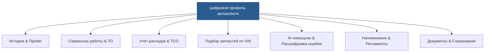
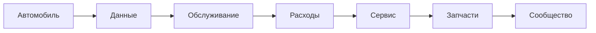
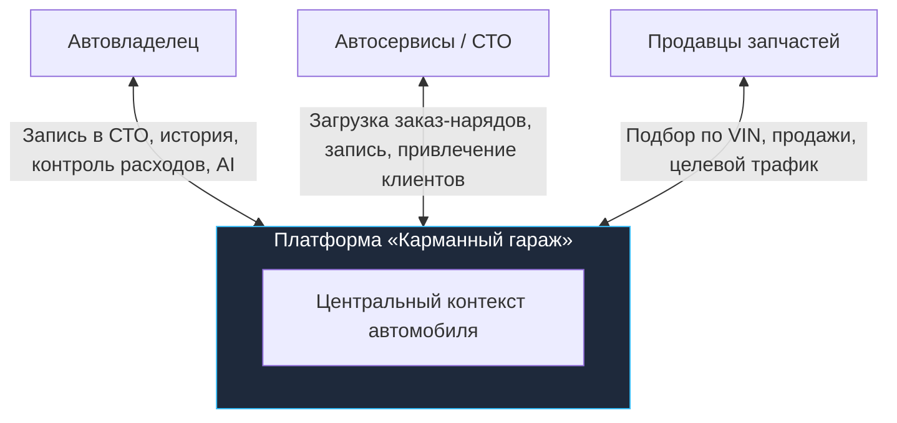
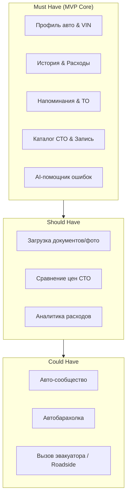
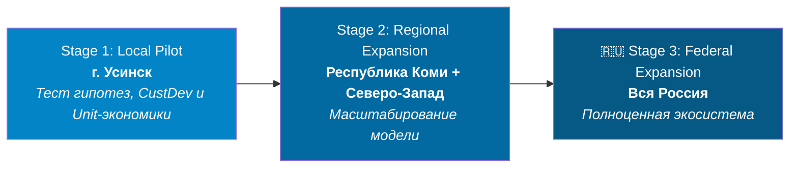

# Product Vision - «Карманный гараж»

> **Vision Statement:** «Сделать обслуживание автомобиля таким же понятным, прозрачным и управляемым, как управление личными финансами через банковское приложение».

---

## 1. Обзор продукта и архитектура связей

**«Карманный гараж»** - цифровая экосистема и операционная система для владения автомобилем, объединяющая ключевые сценарии автожизни вокруг единого цифрового профиля транспортного средства.

### Ключевая концепция продуктового потока

---

## 2. Миссия и Проблематика

### Миссия продукта

Снизить рутину и сложность владения автомобилем за счёт объединения разрозненных данных, сервисов и умных рекомендаций в единой цифровой среде.

### Матрица проблем пользователя

| Проблема (Problem) | Последствие (Impact) |
| --- | --- |
| Данные хранятся в разных местах (заметки, бумажки, чаты) | Потеря времени, хаос в документах |
| Отсутствует сквозная история обслуживания | Сложно оценить реальное состояние и остаточную стоимость авто |
| Пропуск сроков планового ТО | Дорогие поломки из-за несвоевременной замены расходников |
| Сложность выбора надежного СТО | Риск переплаты и некачественного ремонта |
| Ошибки при самостоятельном подборе запчастей | Риск покупки несовместимой детали |
| Отсутствие учета расходов | Непонимание реальной стоимости владения (TCO) |
| Непонятные ошибки на приборной панели (Check Engine) | Тревожность, стресс и неверные действия водителя |

---

## 3. Целевая аудитория и сегментация

Основная аудитория - автовладельцы **25-45 лет**, регулярно эксплуатирующие авто, ценящие свое время и активно пользующиеся цифровыми сервисами.

* **Segment A (Начинающий):** Нужна прозрачность цен, понятные разъяснения без профессионального жаргона.
* **Segment B (Опытный):** Нужен единый цифровой инструмент учета, контроля и истории авто.
* **Segment C (Digital-native):** Требует объединения 5+ разрозненных автоприложений в одно.
* **Segment D (Владелец EV):** Нуждается в специфическом профиле (батарея SoH, зарядки, специфичный сервис) - *перспектива развития*.

---

## 4. Jobs-to-be-Done (JTBD)

* **Functional:**
* При необходимости ТО - быстро узнать регламентный список работ без долгих поисков.
* При поиске сервиса - сравнить варианты по рейтингу, стоимости и локации.
* При покупке запчастей - подбирать детали со 100% гарантией совместимости по VIN.
* При появлении ошибки - быстро оценить критичность поломки и порядок действий.

* **Emotional:** Ощущение полного контроля над автомобилем, уверенность в честности СТО, снижение стресса при поломках.
* **Social:** Доступ к проверенным советам локального автосообщества и взаимопомощь на дорогах.

---

## 5. Ценностное предложение (Value Proposition)

---

## 6. Продуктовые принципы

1. **Car-centric:** Автомобиль - ядро системы. Все сервисы строятся вокруг конкретного транспортного средства.
2. **Data once - use everywhere:** Единоразовый ввод данных (*VIN $\rightarrow$ Гараж $\rightarrow$ Запись в СТО $\rightarrow$ Заказ-наряд $\rightarrow$ История*).
3. **Transparency first:** Прозрачность сметок, цен, исполнителей и причин назначения сервисных работ.
4. **Recommendation over information:** Подача информации через готовые решения (*не «Пробег 60 000 км», а «Рекомендуется замена тормозной жидкости и колодок»*).
5. **Trust by design:** Жесткая защита отзывов, рейтингов и историй ремонтов от накруток (верификация по заказ-нарядам).
6. **Minimum user effort:** Максимально простое выполнение целевых сценариев в минимальное количество кликов.

---

## 7. Границы продукта (MVP vs Non-Goals)

### Исключено из MVP (Non-Goals)

* Собственная платёжная инфраструктура и страхование;
* Собственная сеть автосервисов;
* Полноценная социальная сеть;
* Глубокая OBD-диагностика без внешнего оборудования.

### Границы функционала (MoSCoW Framework)

---

## 8. Перспективы развития (Future Scope)

* **Predictive Maintenance:** Прогнозирование поломок на основе статистического анализа пробега, возраста и частых болячек конкретной модели.
* **Advanced AI Assistant:** Полноценный voice/chat ассистент для диалоговой диагностики и моментального бронирования сервиса.
* **EV Profile:** Специализированные модули для электромобилей (мониторинг батареи, карты зарядок).
* **B2B Ecosystem:** Полноценный маркетплейс запчастей с интеграцией остатков складов и автосервисов.

---

## 9. Управление рисками

| Риск | Уровень | Стратегия снижения (Mitigation) |
| --- | --- | --- |
| Нехватка данных об авто | Высокий | Интеграция с внешними базами (VIN-декодеры) + фокус на простой manual-ввод |
| Неактуальные прайсы СТО | Высокий | Простая система обновления цен для партнеров + модерация |
| Накрутка рейтингов | Высокий | Верификация отзывов строго по подтвержденным заказ-нарядам |
| Сопротивление СТО к IT | Высокий | Легкий и бесплатно предоставляемый B2B-кабинет партнеров |
| Галюцинации AI в диагностике | Критический | Строгие дисклеймеры, фокус на справочные данные и рекомендацию посетить СТО |
| Низкий Retention | Высокий | Регулярные полезные касания (напоминания о штрафах, ТО, страховке) |

---

## 10. Стратегия запуска (Go-To-Market)

Продвижение строится по модели **Local-first** с последовательной региональной экспансией:

### Ключевые метрики успеха (KPIs)

* **Продуктовые:** Activation Rate, D7 / D30 Retention, % пользователей с заполненным гаражом.
* **Бизнес & Маркетплейс:** Conversion Rate в запись в СТО, Количество проведенных транзакций, LTV, CAC.
