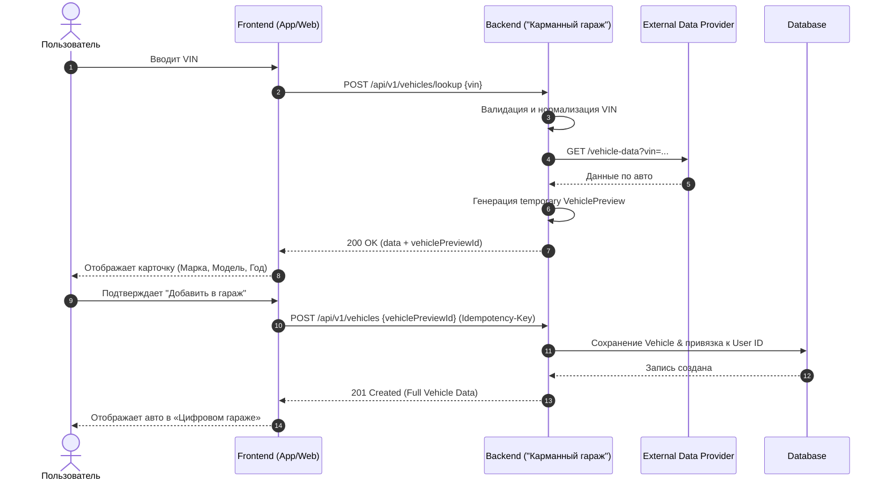

# API Contract - Vehicle Subsystem

> **Паспорт документа**
> | Параметр | Значение |
> | --- | --- |
> | **Модуль** | Vehicle API (`/api/v1/vehicles`) |
> | **Контекст** | UC-001 «Добавление автомобиля по VIN» |
> | **Версия** | 1.0 (Draft) |
> | **Протокол** | REST API (HTTPS / JSON / UTF-8) |
> | **Ответственный** | Project Author / Lead Backend Engineer |
> 
> 

---

## 1. Общие технические требования

* **Базовый URL:** `/api/v1`
* **Авторизация:** `Authorization: Bearer <access_token>` (OAuth 2.0 / JWT)
* **Трассировка:** Заголовок `X-Request-ID: <uuid>` обязателен для всех запросов для сквозного логирования.
* **Идемпотентность:** Заголовок `Idempotency-Key: <uuid>` обязателен для мутирующих методов (`POST /api/v1/vehicles`).

---

## 2. Архитектура и Сценарий взаимодействия

Процесс добавления авто разделен на два этапа (**Lookup** $\rightarrow$ **Creation**), чтобы исключить создание фантомных записей в БД до подтверждения пользователем.



---

## 3. Эндпоинты спецификации

### 3.1. Предварительный поиск по VIN (Lookup)

```http
POST /api/v1/vehicles/lookup
Content-Type: application/json
Authorization: Bearer <access_token>
X-Request-ID: 7f2c1d6e-1111-4444-8888-123456789abc

```

#### Request Body

```json
{
  "vin": "JTNB11HK5K3000001"
}

```

#### Response (200 OK)

```json
{
  "data": {
    "vehiclePreviewId": "vp_01J123456789",
    "vin": "JTNB11HK5K3000001",
    "manufacturer": "Toyota",
    "model": "Camry",
    "generation": "XV70",
    "productionYear": 2020,
    "engine": {
      "volume": 2.5,
      "fuelType": "petrol"
    }
  }
}

```

---

### 3.2. Создание автомобиля в гараже

```http
POST /api/v1/vehicles
Content-Type: application/json
Authorization: Bearer <access_token>
Idempotency-Key: e4a31b2c-9999-4444-8888-987654321xyz
X-Request-ID: 7f2c1d6e-1111-4444-8888-123456789abc

```

#### Request Body

```json
{
  "vehiclePreviewId": "vp_01J123456789"
}

```

#### Response (201 Created)

```json
{
  "data": {
    "id": "veh_01J123456789",
    "vin": "JTNB11HK5K3000001",
    "manufacturer": "Toyota",
    "model": "Camry",
    "generation": "XV70",
    "productionYear": 2020,
    "engine": {
      "volume": 2.5,
      "fuelType": "petrol"
    },
    "createdAt": "2026-08-07T12:00:00Z"
  }
}

```

---

### 3.3. Получение списка автомобилей пользователя

```http
GET /api/v1/vehicles
Authorization: Bearer <access_token>
X-Request-ID: 7f2c1d6e-1111-4444-8888-123456789abc

```

#### Response (200 OK)

```json
{
  "data": [
    {
      "id": "veh_01J123456789",
      "manufacturer": "Toyota",
      "model": "Camry",
      "productionYear": 2020,
      "vinMasked": "JTNB********0001"
    }
  ],
  "meta": {
    "total": 1
  }
}

```

---

### 3.4. Получение подробной карточки автомобиля

```http
GET /api/v1/vehicles/{vehicleId}
Authorization: Bearer <access_token>
X-Request-ID: 7f2c1d6e-1111-4444-8888-123456789abc

```

#### Response (200 OK)

```json
{
  "data": {
    "id": "veh_01J123456789",
    "vinMasked": "JTNB********0001",
    "manufacturer": "Toyota",
    "model": "Camry",
    "generation": "XV70",
    "productionYear": 2020,
    "engine": {
      "volume": 2.5,
      "fuelType": "petrol"
    }
  }
}

```

---

## 4. Безопасность и правила валидации

### Серверные проверки VIN

1. **Формат:** 17 символов, латиница и цифры (исключая `I`, `O`, `Q`).
2. **Нормализация:** Приведение всех символов к верхнему регистру (UPPERCASE) и удаление дефисов/пробелов.
3. **Безопасность сторонних данных:** Данные внешнего провайдера валидируются и санитайзятся на Backend перед записью в БД.
4. **Маскирование:** В публичных списках VIN отображается с маской: `JTNB********0001`.

---

## 5. Коды ответов и Обработка ошибок

### Стандартные HTTP-коды

| Статус | Код | Описание сценария |
| --- | --- | --- |
| **200** | OK | Успешное выполнение `GET` или `lookup` |
| **201** | Created | Автомобиль успешно создан |
| **400** | Bad Request | Неверный синтаксис запроса или формата VIN |
| **401** | Unauthorized | Токен авторизации отсутствует или невалиден |
| **403** | Forbidden | Нет прав доступа к запрашиваемому `vehicleId` |
| **404** | Not Found | Автомобиль или `vehiclePreviewId` не найден |
| **409** | Conflict | Автомобиль с таким VIN уже добавлен пользователем |
| **422** | Unprocessable Entity | Ошибка бизнес-валидации |
| **429** | Too Many Requests | Превышен лимит запросов к API |
| **502** | Bad Gateway | Внешний провайдер авто-данных недоступен |

### Единая структура ошибки

```json
{
  "error": {
    "code": "VIN_INVALID",
    "message": "Проверьте корректность введённого VIN-кода.",
    "requestId": "7f2c1d6e-1111-4444-8888-123456789abc"
  }
}

```

### Справочник бизнес-ошибок

| Код ошибки | HTTP Статус | Описание |
| --- | --- | --- |
| `VIN_INVALID` | 400 | VIN не прошел валидацию формата или контрольную сумму |
| `VEHICLE_NOT_FOUND` | 404 | Автомобиль не найден в реестре внешнего поставщика |
| `PREVIEW_EXPIRED` | 404 | Срок действия `vehiclePreviewId` истек |
| `VEHICLE_ALREADY_EXISTS` | 409 | Запись с таким VIN уже привязана к аккаунту |
| `VEHICLE_ACCESS_DENIED` | 403 | Запрошен чужой `vehicleId` |
| `VEHICLE_PROVIDER_UNAVAILABLE` | 502 | Таймаут или сбой API внешнего провайдера |

---

## 6. Трассируемость (Traceability Matrix)

### Маппинг бизнес-правил (Business Rules Mapping)

| Код правила | Описание правила | Реализация в API |
| --- | --- | --- |
| **BRULE-001** | Обязательность валидации VIN | Серверный фильтр валидации в `POST /vehicles/lookup` |
| **BRULE-002** | Автомобиль всегда имеет владельца | Автоматическая привязка `User ID` из JWT-токена в `POST /vehicles` |
| **BRULE-003** | Контроль дубликатов | Проверка уникальности пары `(user_id, vin)` $\rightarrow$ `409 Conflict` |
| **BRULE-004** | Изоляция данных пользователей | Проверка прав собственности на `vehicleId` в middleware |
| **BRULE-005** | Защита от повторных отправка форм | Обработка `Idempotency-Key` при создании авто |

### Маппинг функциональных требований (FR Mapping)

| Код FR | Описание требования | Реализация в API |
| --- | --- | --- |
| **FR-001** | Добавление ТС по VIN | `POST /api/v1/vehicles` |
| **FR-002** | Декодирование VIN | `POST /api/v1/vehicles/lookup` |
| **FR-003** | Интеграция с внешним API | Внутренний HTTP-клиент в ручке `/lookup` |
| **FR-004** | Просмотр списка авто | `GET /api/v1/vehicles` |
| **FR-005** | Просмотр деталей авто | `GET /api/v1/vehicles/{vehicleId}` |

---

## 7. Открытые вопросы и Перспективы

### Открытые вопросы (Open Questions)

* **OQ-API-001:** Какой конкретно вендор внешнего API данных (Carquery, Drom, Auto.ru, VinDecoder) выбирается в качестве основного/резервного?
* **OQ-API-002:** Каков exact TTL (время жизни) записи `Vehicle Preview` до сброса (сейчас предполагается 15-30 минут)?
* **OQ-API-003:** Требуется ли кэширование ответов внешнего провайдера по VIN в Redis для экономии стоимости API-запросов?

### Будущие эндпоинты (Future Scope)

В следующих версиях API (v1.x / v2.0) запланировано добавление:

* `PUT /api/v1/vehicles/{vehicleId}` — Редактирование параметров авто
* `DELETE /api/v1/vehicles/{vehicleId}` — Удаление (Soft Delete) авто из гаража
* `GET /api/v1/vehicles/{vehicleId}/history` — Получение полной сервисной истории
* `GET /api/v1/vehicles/{vehicleId}/expenses` — Сводка расходов по ТС

---

## 8. Статус готовности

| Компонент | Статус |
| --- | --- |
| **API Contract Schema** | Defined |
| **Endpoints Definition** | Defined |
| **Error Handling Model** | Defined |
| **Sequence Diagram** | Complete |
| **OpenAPI / Swagger Spec** | In Progress (Next Step) |
| **Mock Server Deployment** | Planned |
| **Ответственный** | Project Author / Lead Backend Engineer |
