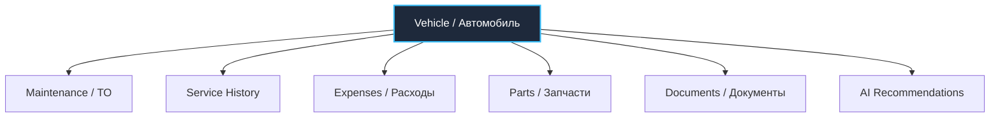
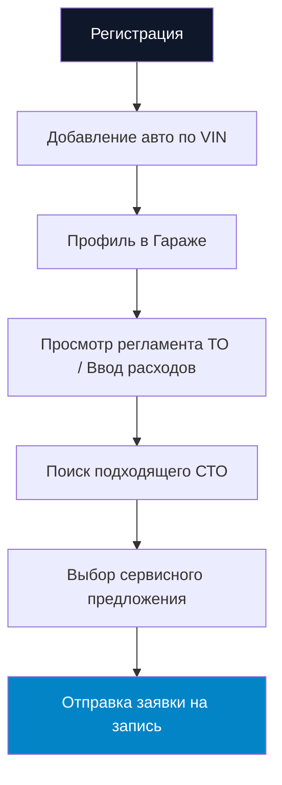
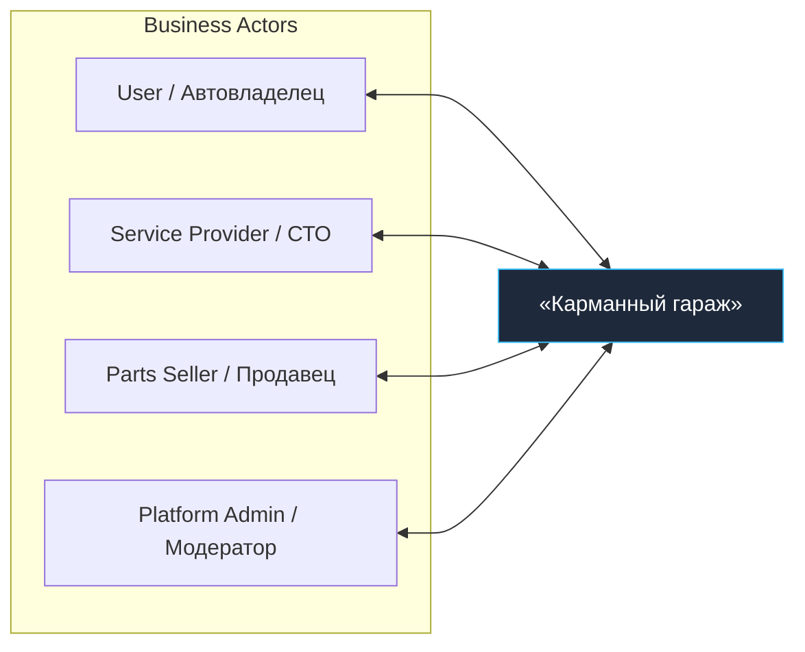
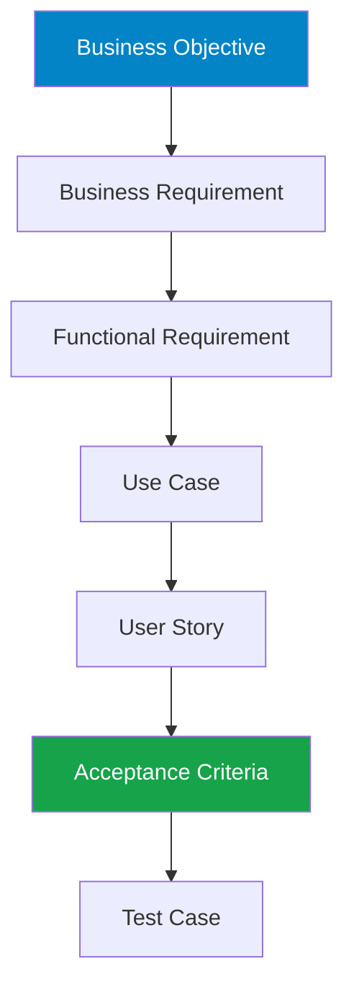
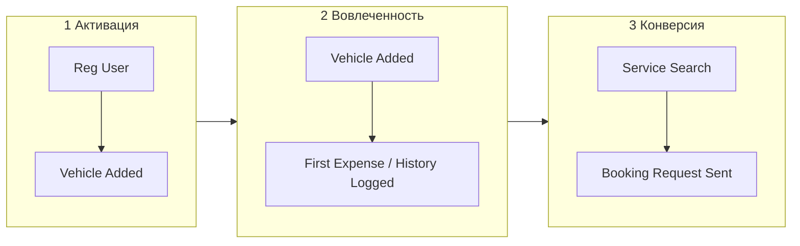

# Business Requirements Document (BRD) - «Карманный гараж»

> **Паспорт документаation**
> | Параметр | Значение |
> | --- | --- |
> | **Продукт** | Платформа «Карманный гараж» |
> | **Тип документа** | Business Requirements Document (BRD) |
> | **Версия** | 1.0 (Draft) |
> | **Этап проекта** | Product Discovery / Requirements Analysis |
> | **Ответственный** | Product Manager / Project Author |
> 
> 

---

## 1. Обзор и Бизнес-контекст

### Назначение документа

Формализация верхнеуровневых бизнес-требований, целей, границ (Scope) и бизнес-правил платформы «Карманный гараж» для создания единой цифровой экосистемы управления автомобилем.

### Бизнес-возможность (Business Opportunity)

Фрагментированность рынка автоуслуг создает высокую когнитивную нагрузку на пользователя. Единый цифровой контекст автомобиля позволяет:

* Снизить рутинные затраты времени автовладельца;
* Обеспечить сквозную прозрачность истории обслуживания;
* Сформировать для СТО и продавцов запчастей прогнозируемый B2B-канал привлечения клиентов;
* Повысить LTV пользователя за счет регулярных повторных транзакций.

---

## 2. Центральная сущность и цепочка ценности

Вся архитектура требований строится вокруг единственной ключевой сущности - **Vehicle (Автомобиль)**.

### Бизнес-цепочка создания ценности (Value Chain)

---

## 3. Бизнес-цели (Business Objectives)

| ID | Цель (Objective) | Ожидаемый бизнес-результат |
| --- | --- | --- |
| **BO-01** | Centralized Vehicle Data | Единый цифровой профиль с доступом к полной истории авто в один клик |
| **BO-02** | Maintenance Management | Своевременные напоминания и автоматический расчет регламентов ТО |
| **BO-03** | Service Discovery | Быстрый поиск, сравнение и выбор проверенных СТО по локации и рейтингу |
| **BO-04** | Service Booking | Бесшовная онлайн-запись или отправка заявки в СТО без обзвонов |
| **BO-05** | Parts Discovery | Автоматический подбор 100% совместимых запчастей по VIN-коду |
| **BO-06** | Cost Management | Прозрачный учет TCO (Total Cost of Ownership) по категориям и периодам |
| **BO-07** | Emergency Assistance | Быстрая маршрутизация пользователя при экстренных поломках (SOS) |
| **BO-08** | Transaction Ecosystem | Монетизация комиссий от СТО, продажи запчастей и партнёрских сервисов |

---

## 4. Границы MVP и Пользовательский поток

### MVP Boundary (Ключевой сценарий)

### Бизнес-акторы системы

---

## 5. Бизнес-требования (Business Requirements)

| ID | Требование | Описание | Приоритет |
| --- | --- | --- | --- |
| **BR-01** | Vehicle Management | Добавление, редактирование и удаление автомобилей в гараже аккаунта | **P0** |
| **BR-02** | Vehicle Identification | Идентификация авто по VIN-коду и госномеру с автоматическим декодированием параметров | **P0** |
| **BR-03** | Vehicle History | Ведение истории (дата, пробег, тип работ, запчасти, чеки, фото, сумма) | **P0** |
| **BR-04** | Maintenance Planning | Автоматический расчет даты и пробега следующего ТО с Push/Email уведомлениями | **P0** |
| **BR-05** | Expense Management | Учет расходов по категориям (топливо, ТО, мойка, страховка, запчасти, шины) | **P0** |
| **BR-06** | Service Discovery | Каталог СТО с фильтрацией по геопозиции, рейтингу, услугам и ценам | **P0** |
| **BR-07** | Service Booking | Передача заявки или запись на выбранное время в B2B-кабинет СТО | **P0** |
| **BR-08** | Price Transparency | Отображение статуса цены (Фиксированная, Ориентировочная, От N руб, Требует диагностики) | **P1** |
| **BR-09** | Parts Search | Поиск оригиналов и аналогов запчастей с учетом спецификации конкретного авто | **P1** |
| **BR-10** | Parts Comparison | Сравнение предложений продавцов по цене, наличию, срокам доставки и производителю | **P1** |
| **BR-11** | Community & Chat | Локальное автомобильное сообщество, взаимопомощь и форумы по моделям | **P2** |
| **BR-12** | Emergency Assistance | SOS-сервисы (вызов эвакуатора, подвоз топлива, прикурить АКБ) в 1 клик | **P1** |
| **BR-13** | AI Assistant | Экспресс-интерпретация кодов ошибок (Check Engine) и рекомендация первых шагов | **P1** |

---

## 6. Бизнес-правила и Ограничения

### Бизнес-правила (Business Rules)

* **BRULE-01:** Пользователь может владеть несколькими автомобилями в одном профиле.
* **BRULE-02:** VIN является уникальным первичным идентификатором ТС в системе.
* **BRULE-03:** Любая запись о ремонте или расходе привязывается к конкретному автомобилю.
* **BRULE-04:** AI-рекомендация носит справочный характер и не является юридически гарантированным диагнозом (**BRULE-07**).
* **BRULE-05:** Платное продвижение СТО не имеет права влиять на органический пользовательский рейтинг (**BRULE-09**).
* **BRULE-06:** Стоимость работ без подтверждения мастера отображается как «Ориентировочная» (**BRULE-10**).

### Бизнес-ограничения (Business Constraints)

* **BC-01 (Data Quality):** Зависимость полноты авто-данных от внешних VIN-декодеров и реестров.
* **BC-02 (Integrations):** Доступность онлайн-записи ограничена наличием CRM/IT-системы у конкретного СТО.
* **BC-03 (Price Volatility):** Окончательная стоимость ремонта может меняться после очной диагностики.
* **BC-04 (AI Compliance):** AI-модель должна содержать дисклеймеры для предотвращения рисков безопасности.

---

## 7. Трассируемость и Метрики успеха

### Иерархия трассируемости требований (Requirements Traceability)

### Ключевые показатели эффективности (KPIs)

---

## 8. Текущий статус проекта

| Область | Статус | Ответственный |
| --- | --- | --- |
| **Business Objectives** | Defined (Утверждено) | Product Owner |
| **Business Requirements** | Draft v1.0 (На рецензии) | Lead Analyst |
| **Business Rules & Constraints** | Initial (Сформировано) | System Architect |
| **MVP Scope & Boundaries** | Defined (Зафиксировано) | Product Manager |
| **Requirements Traceability** | Planned (В разработке) | QA Lead / BA |
| **Следующий шаг** | Stakeholder Analysis & Functional Requirements (FRD) | Project Team |
