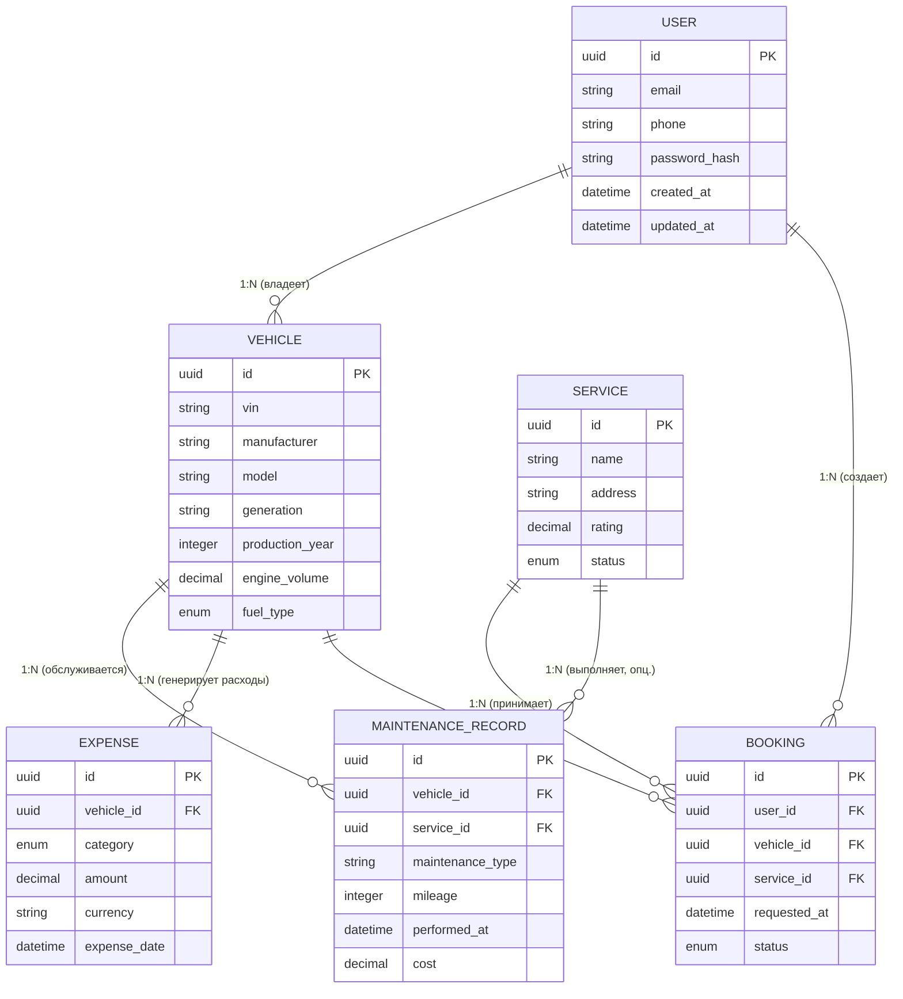
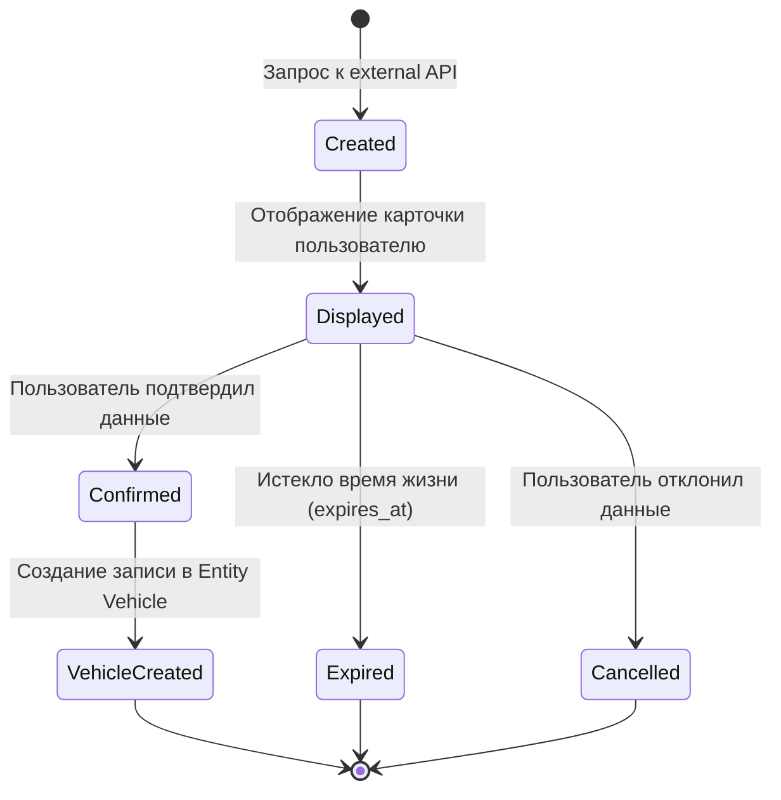

# Logical Data Model - «Карманный гараж»

> **Паспорт документа**
> | Параметр | Значение |
> | --- | --- |
> | **Продукт** | Платформа «Карманный гараж» |
> | **Тип документа** | Logical Data Model (MVP) |
> | **Версия** | 1.0 (Draft) |
> | **Этап проекта** | Product Discovery / Technical Specification |
> | **Ответственный** | Project Author / Lead Architect |
> 
> 

---

## 1. Обзор и архитектура сущностей

Документ описывает логическую модель данных MVP платформы «Карманный гараж». Модель независима от конкретной СУБД и определяет базовые бизнес-сущности, их атрибуты, правила целостности и связи.

### Сущности MVP

---

## 2. Детализация сущностей и атрибутов

### Entity: User

Представляет зарегистрированного пользователя платформы.

| Поле | Тип | Обязательное | Описание |
| --- | --- | --- | --- |
| `id` | UUID | Да | Уникальный технический идентификатор |
| `email` | string | Да | Email пользователя (логин) |
| `phone` | string | Нет | Номер телефона |
| `password_hash` | string | Да | Хэш пароля |
| `created_at` | datetime | Да | Дата и время регистрации |
| `updated_at` | datetime | Да | Дата и время последнего обновления профиля |

---

### Entity: Vehicle

Центральная бизнес-сущность продукта - автомобиль пользователя.

| Поле | Тип | Обязательное | Описание |
| --- | --- | --- | --- |
| `id` | UUID | Да | Внутренний технический идентификатор записи |
| `vin` | string | Да | Бизнес-идентификатор (VIN / Номер кузова) |
| `manufacturer` | string | Да | Марка / Производитель |
| `model` | string | Да | Модель |
| `generation` | string | Нет | Поколение |
| `production_year` | integer | Нет | Год выпуска |
| `engine_volume` | decimal | Нет | Объём двигателя (в литрах) |
| `fuel_type` | enum | Нет | Тип топлива (`PETROL`, `DIESEL`, `ELECTRIC`, `HYBRID`, `GAS`) |
| `created_at` | datetime | Да | Дата создания записи |
| `updated_at` | datetime | Да | Дата изменения записи |

#### Ограничения VIN

* VIN является бизнес-идентификатором ТС, тогда как `Vehicle ID` - техническим `Primary Key`.
* Обязателен к заполнению, проходит серверную валидацию формата и нормализацию (приведение к UPPERCASE, исключение символов I, O, Q).
* Имеет уникальное ограничение в системе в рамках бизнес-правил владения.

---

### Entity: Vehicle Preview

Временное представление данных автомобиля, полученных из внешних реестров/API до подтверждения пользователем.

| Поле | Тип | Обязательное | Описание |
| --- | --- | --- | --- |
| `id` | UUID | Да | Идентификатор превью-записи |
| `vin` | string | Да | Запрошенный VIN |
| `provider` | string | Да | Поставщик внешних данных |
| `payload` | JSON | Да | Сырые декодированные данные |
| `expires_at` | datetime | Да | Срок годности временной записи |
| `created_at` | datetime | Да | Дата получения данных |

---

### Entity: Maintenance Record

Запись о фактически выполненном обслуживании или ремонте.

| Поле | Тип | Обязательное | Описание |
| --- | --- | --- | --- |
| `id` | UUID | Да | Идентификатор записи |
| `vehicle_id` | UUID | Да | Ссылка на автомобиль (FK) |
| `service_id` | UUID | Нет | Ссылка на СТО (FK, если работа делалась в сервисе) |
| `maintenance_type` | string | Да | Тип работ (нормализуется в Enum/Справочник) |
| `mileage` | integer | Нет | Пробег на момент выполнения работ |
| `performed_at` | datetime | Да | Дата и время проведения работ |
| `cost` | decimal | Нет | Стоимость выполненных работ |
| `description` | text | Нет | Дополнительные комментарии и детали |
| `created_at` | datetime | Да | Дата внесения записи |

**Базовые типы работ (`maintenance_type`):**
`Oil Change`, `Brake Pads Replacement`, `Air Filter Replacement`, `Cabin Filter Replacement`, `Timing Belt Replacement`, `Tire Service`, `Diagnostics`, `Repair`, `Other`.

---

### Entity: Expense

Фиксация любых финансовых расходов на содержание ТС.

| Поле | Тип | Обязательное | Описание |
| --- | --- | --- | --- |
| `id` | UUID | Да | Идентификатор расхода |
| `vehicle_id` | UUID | Да | Ссылка на автомобиль (FK) |
| `category` | enum | Да | Категория расхода |
| `amount` | decimal | Да | Сумма расхода |
| `currency` | string | Да | Валюта (по умолчанию `RUB`) |
| `expense_date` | datetime | Да | Дата совершения платежа |
| `mileage` | integer | Нет | Пробег на момент расхода |
| `description` | text | Нет | Заметка к платежу |
| `created_at` | datetime | Да | Дата внесения записи |

**Перечень категорий (`category`):**
`Fuel`, `Maintenance`, `Repair`, `Parts`, `Insurance`, `Car Wash`, `Tire Service`, `Evacuation`, `Other`.

---

### Entity: Service

Автосервис (СТО), зарегистрированный на платформе.

| Поле | Тип | Обязательное | Описание |
| --- | --- | --- | --- |
| `id` | UUID | Да | Идентификатор СТО |
| `name` | string | Да | Название автосервиса |
| `description` | text | Нет | Описание и специализация |
| `phone` | string | Нет | Контактный телефон |
| `address` | string | Да | Физический адрес |
| `latitude` | decimal | Нет | Географическая широта (для поиска на карте) |
| `longitude` | decimal | Нет | Географическая долгота |
| `rating` | decimal | Нет | Рассчитанный агрегированный рейтинг |
| `status` | enum | Да | Статус сервиса на платформе |
| `created_at` | datetime | Да | Дата регистрации СТО |
| `updated_at` | datetime | Да | Дата изменения профиля СТО |

**Перечень статусов (`status`):**
`ACTIVE`, `INACTIVE`, `SUSPENDED`, `PENDING_VERIFICATION`.

---

### Entity: Booking

Заявка пользователя на обслуживание в конкретном СТО.

| Поле | Тип | Обязательное | Описание |
| --- | --- | --- | --- |
| `id` | UUID | Да | Идентификатор заявки |
| `user_id` | UUID | Да | Ссылка на пользователя (FK) |
| `vehicle_id` | UUID | Да | Ссылка на автомобиль (FK) |
| `service_id` | UUID | Да | Ссылка на СТО (FK) |
| `requested_at` | datetime | Да | Дата и время создания заявки |
| `requested_date` | datetime | Нет | Желаемые дата и время визита |
| `service_type` | string | Нет | Запрашиваемая услуга |
| `comment` | text | Нет | Комментарий пользователя к проблеме |
| `status` | enum | Да | Статус обработки заявки |
| `created_at` | datetime | Да | Дата создания записи |
| `updated_at` | datetime | Да | Дата изменения статуса |

**Жизненный цикл заявки (`status`):**
`REQUESTED` $\rightarrow$ `CONFIRMED` / `DECLINED` $\rightarrow$ `COMPLETED` / `CANCELLED` / `NO_SHOW`.

---

## 3. Связи между сущностями (Relationships)

* **User $\rightarrow$ Vehicle (`1 : N`):** Один пользователь может владеть несколькими авто. Каждое авто связано минимум с одним пользователем.
* **Vehicle $\rightarrow$ Maintenance Record (`1 : N`):** Автомобиль накапливает историю проведенных работ.
* **Vehicle $\rightarrow$ Expense (`1 : N`):** Автомобиль генерирует множество записей расходов.
* **Service $\rightarrow$ Maintenance Record (`1 : N`):** СТО может быть исполнителем множества работ (связь опциональна, если пользователь вносит данные вручную).
* **User $\rightarrow$ Booking (`1 : N`):** Пользователь может создавать множество заявок на ремонт.
* **Vehicle $\rightarrow$ Booking (`1 : N`):** Для одного авто может создаваться серия заявок во времени.
* **Service $\rightarrow$ Booking (`1 : N`):** СТО получает поток заявок от разных пользователей.

---

## 4. Правила целостности данных (Data Integrity Rules)

| Код | Правило целостности |
| --- | --- |
| **DI-001** | Сущность `Vehicle` не может существовать без привязанного владельца (`User`). |
| **DI-002** | `Maintenance Record` обязана ссылаться на действующий `Vehicle`. |
| **DI-003** | `Expense` обязана ссылаться на действующий `Vehicle`. |
| **DI-004** | `Booking` должна одновременно содержать корректные ссылки на `User`, `Vehicle` и `Service`. |
| **DI-005** | Удаление `Vehicle` не должно приводить к каскадному неконтролируемому удалению истории и расходов (требуется политика архивации). |
| **DI-006** | Значение `Expense.amount` должно быть строго больше нуля ($\ge 0$). |
| **DI-007** | Значение `MaintenanceRecord.cost` не может быть отрицательным ($\ge 0$). |
| **DI-008** | Заявка (`Booking`) не может быть создана на СТО со статусом, отличным от `ACTIVE`. |

---

## 5. Системные механизмы: Soft Delete, Audit & Ownership

### Стратегия удаления (Soft Delete)

Для критичных сущностей физическое удаление из базы запрещено. Применяется атрибут `deleted_at (datetime, nullable)`:

* `Vehicle`, `Maintenance Record`, `Expense`, `Booking`.

### Аудит изменений

Для отслеживания истории изменений предусматривается стандартный набор полей аудита:
`created_at`, `updated_at`, `created_by`, `updated_by` + отдельная таблица `AuditLog` для критичных операций.

### Матрица владения данными (Data Ownership & Privacy)

| Сущность | Владелец (Owner) | Доступ |
| --- | --- | --- |
| **User** | Platform | Приватный (только владелец) |
| **Vehicle** | User | Приватный (только владелец аккаунта) |
| **Vehicle Preview** | Platform / Context | Временный контекстный доступ |
| **Maintenance Record** | User | Приватный (владелец авто) |
| **Expense** | User | Приватный (владелец авто) |
| **Service** | Service Provider | Публичный (каталог) / Приватный (кабинет СТО) |
| **Booking** | User + Service Provider | Двусторонний доступ (Клиент и СТО) |

---

## 6. Предложение по индексации (Indexes Proposal)

Для обеспечения производительности на уровне физической СУБД рекомендуется создание следующих индексов:

* `User(email)` — B-Tree, Unique (быстрый поиск при авторизации);
* `Vehicle(vin)` — B-Tree (поиск и проверка уникальности);
* `Vehicle(user_id)` — B-Tree (выборка гаража пользователя);
* `MaintenanceRecord(vehicle_id)` — B-Tree (загрузка истории авто);
* `Expense(vehicle_id, expense_date)` — Составной B-Tree (аналитика расходов за период);
* `Booking(user_id)`, `Booking(service_id)`, `Booking(vehicle_id)` — B-Tree (фильтрация списков заявок);
* `Service(latitude, longitude)` — GiST / SP-GiST или Spatial index (поиск СТО по радиусу на карте).

---

## 7. Открытые вопросы (Open Questions)

* **OQ-DATA-001:** Может ли один автомобиль одновременно находиться в гараже нескольких пользователей (например, семейный доступ)?
* **OQ-DATA-002:** Требуется ли выделять отдельную промежуточную сущность `VehicleOwnership` для связи M:N?
* **OQ-DATA-003:** Нужно ли хранить историческую цепочку смены владельцев ТС?
* **OQ-DATA-004:** Какой минимальный набор характеристик авто обязателен при ручном вводе (без VIN)?
* **OQ-DATA-005:** Потребуется ли в MVP отдельная сущность для хранения документов ТС (СТС, ПТС, ОСАГО)?
* **OQ-DATA-006:** Каков алгоритм загрузки и сжатия медиафайлов (чеки, фото выполненных работ)?
* **OQ-DATA-007:** Требуется ли универсальная сущность `Attachment` для привязки файлов к чекам и ремонтам?
* **OQ-DATA-008:** Есть ли лимиты на максимальное количество записей истории на один автомобиль?
* **OQ-DATA-009:** Требуется ли мультивалютность в таблице расходов для приграничных регионов?

---

## 8. Сущности будущих версий (Future Scope)

В следующих релизах платформа будет расширена сущностями:

`Part`, `PartOffer`, `Seller`, `Review`, `ServicePrice`, `MaintenancePlan`, `Reminder`, `Document`, `Attachment`, `Notification`, `Community`, `Post`, `Comment`, `InsurancePolicy`, `EmergencyRequest`, `AIRequest`, `AIRecommendation`.

---

## 9. Текущий статус проектирования

| Область | Статус |
| --- | --- |
| **Logical Data Model** | Draft v1.0 |
| **Core Entities & Attributes** | Defined |
| **Relationships & ERD** | Defined |
| **Integrity Rules & Privacy** | Initial |
| **Physical Model (DDL)** | Not Started |
| **Следующий шаг** | Architecture Design & API Contracts (FRD/OpenAPI) |
| **Ответственный** | Lead Architect / Product Owner |
