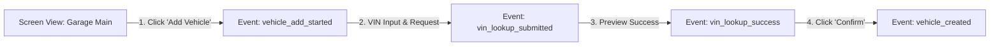
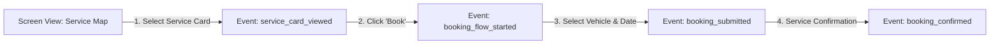

# Product Analytics & Event Tracking — «Карманный гараж»

> **Паспорт документа**
>
> | Параметр | Значение |
> | :--- | :--- |
> | **Продукт** | Цифровая экосистема «Карманный гараж» |
> | **Тип документа** | Tracking Plan & Funnel Specification |
> | **Версия** | 1.0 (MVP) |

---

## 1. Назначение

Настоящий документ содержит план разметки событий (Tracking Plan) для мобильного приложения и бэкенда. События используются для расчета продуктовых метрик, построения воронок конверсии и проведения А/Б-тестов через системы аналитики (Amplitude / AppMetrica / PostHog).

---

## 2. Ключевые воронки конверсии (Funnels)

### 2.1. Воронка активации: «Добавление первого ТС в Гараж» (Onboarding Funnel)



* **Целевая конверсия (CR):** $\ge 70\%$ из `vehicle_add_started` в `vehicle_created`.
* **Основная точка отвала (Drop-off):** `vin_lookup_submitted` $\rightarrow$ неверный формат VIN или отсутствие данных у внешнего провайдера.

---

### 2.2. Воронка конверсии: «Запись на СТО» (Booking Funnel)



* **Целевая конверсия (CR):** $\ge 12\%$ из `service_card_viewed` в `booking_submitted`.

---

## 3. Таблица событий (Tracking Plan / Schema)

### Naming Convention

Все имена событий записаны в `snake_case` в формате: `<object>_<action>`.

| Категория | Имя события (Event Name) | Описание действия | Обязательные атрибуты (Properties) |
| --- | --- | --- | --- |
| **Onboarding** | `user_signed_up` | Успешная регистрация | `auth_provider` ("email", "apple", "google"), `user_id` |
| **Garage** | `vehicle_add_started` | Нажатие на кнопку добавления авто | `source` ("empty_garage_state", "header_button") |
| **Garage** | `vin_lookup_submitted` | Введен VIN и отправлен запрос | `vin_length` (int), `input_method` ("manual", "scanner") |
| **Garage** | `vin_lookup_success` | VIN успешно декодирован | `manufacturer`, `model`, `production_year`, `provider` |
| **Garage** | `vin_lookup_failed` | Ошибка декодирования VIN | `error_code`, `reason` |
| **Garage** | `vehicle_created` | Автомобиль добавлен в БД | `vehicle_id`, `manufacturer`, `model`, `is_first_vehicle` (bool) |
| **Expenses** | `expense_created` | Добавлен новый расход | `expense_id`, `category` ("fuel", "maintenance", "part"), `amount`, `currency` |
| **Services** | `service_card_viewed` | Просмотр карточки СТО | `service_id`, `service_name`, `rating`, `distance_km` |
| **Booking** | `booking_submitted` | Пользователь отправил заявку на СТО | `booking_id`, `service_id`, `vehicle_id`, `service_type` |
| **Booking** | `booking_status_changed` | Изменение статуса записи СТО | `booking_id`, `old_status`, `new_status` ("CONFIRMED", "DECLINED", "CANCELLED") |

---

## 4. Пользовательские свойства (User Properties)

При авторизации и обновлении данных профиля в аналитическую систему передается следующий контекст:

```json
{
  "user_id": "a0eebc99-9c0b-4ef8-bb6d-6bb9bd380a11",
  "vehicles_count": 2,
  "has_active_booking": true,
  "preferred_city": "Usinsk",
  "app_version": "1.2.0",
  "device_os": "iOS 17.4"
}
