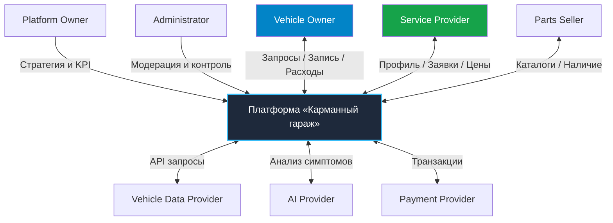

# Stakeholder Analysis - Заинтересованные стороны («Карманный гараж»)

> **Паспорт документа**
> | Параметр | Значение | 
> | --- | --- |
> | **Продукт** | Платформа «Карманный гараж» |
> | **Тип документа** | Stakeholder Analysis |
> | **Версия** | 1.0 (Draft) |
> | **Этап проекта** | Product Discovery / Business Analysis |
> | **Ответственный** | Project Author / Product Manager |
> 
> 

---

## 1. Назначение и группы участников

Документ определяет полный круг участников экосистемы платформы «Карманный гараж», их цели, степени влияния, ожидания и потенциальные точки конфликта интересов.

### Задачи анализа

* Выявление ключевых лиц, принимающих решения, и пользователей системы;
* Определение источников первичных данных и потребителей ценности платформы;
* Проектирование каналов взаимодействия между участниками;
* Формирование требований к продукту для сглаживания конфликтов интересов.

### Категории стейкхолдеров

1. **End Users** - конечные потребители сервиса (автовладельцы);
2. **Business Partners** - B2B-партнеры (СТО, продавцы запчастей, автострахование);
3. **Platform Operations** - внутренняя команда обслуживания и администрирования;
4. **External Systems** - внешние технические провайдеры (API данных авто, эквайринг, AI);
5. **Regulatory / External Actors** - регуляторы и сторонние агенты рынка.

---

## 2. Матрица стейкхолдеров (Stakeholder Matrix)

| ID | Стейкхолдер | Категория | Интерес | Влияние | Приоритет |
| --- | --- | --- | --- | --- | --- |
| **ST-01** | Vehicle Owner (Владелец авто) | End User | High | High | **P0** |
| **ST-02** | Service Provider (Автосервис / СТО) | Business Partner | High | High | **P0** |
| **ST-03** | Parts Seller (Продавец запчастей) | Business Partner | Medium | Medium | **P1** |
| **ST-04** | Platform Administrator (Администратор) | Operations | High | High | **P0** |
| **ST-05** | Platform Owner (Владелец бизнеса) | Business | High | Very High | **P0** |
| **ST-06** | AI Provider (Провайдер AI-моделей) | External System | Medium | Medium | **P1** |
| **ST-07** | Vehicle Data Provider (Поставщик данных) | External System | High | High | **P0** |
| **ST-08** | Payment Provider (Платёжный шлюз) | External System | Medium | High | **P1** |
| **ST-09** | Insurance Partner (Страховая компания) | Business Partner | Medium | Medium | **P2** |

---

## 3. Подробный профиль участников

### ST-01 - Vehicle Owner (Владелец авто)

* **Описание:** Ключевой B2C-пользователь платформы.
* **Цели:** Прозрачный контроль расходов, своевременное ТО, быстрая запись в проверенные СТО, сохранение истории автомобиля, оперативность при поломках.
* **Потребности:** Простая регистрация, предсказуемые цены, понятные технические рекомендации, единый профиль авто.
* **Критерий успеха:** Возможность полностью закрыть задачи по содержанию ТС в одном окне без обзвонов и сторонних сервисов.
* **Цепочка взаимодействия:**
`User` $\rightarrow$ `Vehicle` $\rightarrow$ `Garage` $\rightarrow$ `Maintenance` $\rightarrow$ `Service` $\rightarrow$ `Booking`

### ST-02 - Service Provider (Автосервис / СТО)

* **Описание:** B2B-партнёр, выполняющий работы по обслуживанию и ремонту.
* **Цели:** Привлечение новых клиентов, равномерная загрузка ремзоны, автоматизация приема заявок, сбор отзывов.
* **Потребности:** Удобный профиль СТО, управление прайс-листом и расписанием, обработка заявок, коммуникация с клиентом.
* **Бизнес-ценность:** Получение прогнозируемого цифрового канала привлечения клиентов.
* **Цепочка взаимодействия:**
`Service Provider` $\rightarrow$ `Service Profile` $\rightarrow$ `Service Catalog` $\rightarrow$ `Booking Request` $\rightarrow$ `Booking Status`

### ST-03 - Parts Seller (Продавец запчастей)

* **Описание:** Поставщик новых и б/у автокомпонентов.
* **Цели:** Выход на целевую аудиторию с горячим спросом, увеличение объёма продаж, автоматическая проверка применимости.
* **Потребности:** Интеграция каталогов, передача остатков и цен, поддержка поиска по VIN, обработка заказов.
* **Цепочка взаимодействия:**
`Vehicle` $\rightarrow$ `VIN` $\rightarrow$ `Part Search` $\rightarrow$ `Compatibility` $\rightarrow$ `Seller` $\rightarrow$ `Purchase`

### ST-04 - Platform Administrator (Администратор)

* **Описание:** Внутренний оператор системы, обеспечивающий порядок и модерацию.
* **Цели:** Чистота данных, контроль за качеством работы СТО, разбор конфликтных ситуаций, безопасность.
* **Потребности:** Панель администратора, инструментарий модерации контента, логи аудита, управление пользователями и сервисами.

### ST-05 - Platform Owner (Владелец бизнеса)

* **Описание:** Собственник продукта, определяющий стратегию.
* **Цели:** Построение масштабируемой бизнес-модели, рост доли рынка, положительная Unit-экономика.
* **Ключевые KPIs:** MAU/DAU, Retention, Booking Conversion, GMV, Revenue, CAC, LTV.

### ST-06 - AI Provider (Провайдер AI-сервисов)

* **Описание:** Внешние нейросетевые сервисы для первичного анализа симптомов и фото.
* **Обязанности:** Классификация изображений, расшифровка ошибок Check Engine, генерация понятных рекомендаций.
* **Ограничения:** AI-выдача не является юридическим или гарантированным диагнозом.

### ST-07 - Vehicle Data Provider (Поставщик авто-данных)

* **Описание:** Внешние API-сервисы декодирования VIN и каталогов ТС.
* **Предоставляемые данные:** Марка, модель, год, поколение, параметры двигателя, комплектация.
* **Риски:** Сбои API, тарификация за запросы, неполнота базовых реестров.

### ST-08 - Payment Provider (Платёжная система)

* **Описание:** Финансовый шлюз для обработки онлайн-платежей и холдирования средств.
* **Обязанности:** Проведение транзакций, возвраты, формирование чеков (54-ФЗ), безопасное хранение платежных токенов.

### ST-09 - Insurance Partner (Страховой партнёр)

* **Описание:** Партнёрские страховые компании для оформления ОСАГО/КАСКО.
* **Цели:** Получение целевых лидов на продление страховых полисов на основе данных о сроках владения авто.

---

## 4. Ожидания участников и Конфликты интересов

### Матрица базовых ожиданий

| Стейкхолдер | Ключевое ожидание |
| --- | --- |
| **Vehicle Owner** | Быстрый, удобный и честный сервис по управлению авто |
| **Service Provider** | Стабильный поток записей и удобная обработка заявок |
| **Parts Seller** | Целевые заказы с точным подбором по VIN |
| **Administrator** | Прозрачность процессов и понятные инструменты модерации |
| **Platform Owner** | Устойчивый рост метрик, выручки и доли рынка |
| **AI / Data / Payment Providers** | Стабильность API, соблюдение лимитов и своевременная оплата |
| **Insurance Partner** | Качественный целевой трафик на оформление полисов |

### Анализ и нейтрализация конфликтов

#### Конфликт 01: Vehicle Owner vs Service Provider

* **Суть:** Пользователь ищет минимальную цену ремонта, а СТО стремится увеличить средний чек.
* **Решение в продукте:** Прозрачный статус цены (`Фиксированная`, `Ориентировочная`, `Требует диагностики`), детализация состава услуг до визита, фиксирование цены в заявке.

#### Конфликт 02: Vehicle Owner vs Platform Owner

* **Суть:** Пользователю нужны объективные рекомендации, а платформа зарабатывает на рекламе партнерских СТО.
* **Решение в продукте:** Четкое визуальное отделение платных/промо-блоков от органической выдачи по фильтрам и рейтингу.

#### Конфликт 03: Vehicle Owner vs AI

* **Суть:** Пользователь ждет от AI точного диагноза поломки, но нейросеть может ошибаться.
* **Решение в продукте:** Выдача AI сопровождается уровнем уверенности (Confidence Score) и обязательным дисклеймером о необходимости профессионального осмотра.

---

## 5. Матрица «Власть / Интерес» (Power / Interest Grid)

```
 ВЛАСТЬ (POWER)
   ▲
   │  [Keep Satisfied]                 │  [Manage Closely]
   │  • Payment Provider               │  • Platform Owner (ST-05)
   │  • Vehicle Data Provider (ST-07)  │  • Vehicle Owner (ST-01)
   │                                   │  • Service Provider (ST-02)
   │                                   │  • Platform Administrator (ST-04)
   ┼───────────────────────────────────┼───────────────────────────────────
   │  [Monitor]                        │  [Keep Informed]
   │  • Secondary External Actors      │  • Parts Seller (ST-03)
   │                                   │  • AI Provider (ST-06)
   │                                   │  • Insurance Partner (ST-09)
   └───────────────────────────────────┴───────────────────────────────────► ИНТЕРЕС (INTEREST)

```

---

## 6. Схема взаимодействий и Трассируемость

### Карты связей участников системы



### Цепочка трассируемости требований (Requirements Traceability)


*Пример трассировки:*
`Vehicle Owner` $\rightarrow$ *«Хочу быстро найти проверенное СТО рядом»* $\rightarrow$ `BR-06 (Service Discovery)` $\rightarrow$ `FR-SVC-01 (Поиск и фильтрация СТО)` $\rightarrow$ `UC-002 (Search Service)`.

---

## 7. План CustDev и Проверка гипотез

### Вопросы для интервью: Автовладельцы (Vehicle Owners)

1. Как вы сейчас выбираете СТО для планового ТО или ремонта? Что критично при выборе?
2. Где и в каком виде вы храните историю обслуживания и чеки (бумага, заметки, Excel, никак)?
3. Как вы отслеживаете наступление срока следующего ТО или замены расходников?
4. Покупаете ли вы запчасти сами или полностью доверяете подбор автосервису?

### Вопросы для интервью: Автосервисы (Service Providers)

1. Каковы ваши основные каналы привлечения новых клиентов сейчас?
2. Как у вас организован процесс приема и обработки входящих заявок (телефон, мессенджеры, CRM)?
3. Используете ли вы системы онлайн-записи? Если нет, то почему?
4. Скими главными проблемами вы сталкиваетесь при работе с агрегаторами автоуслуг?

### Проверка гипотез (Validation Checklist)

* Подтверждение реальной готовности СТО платить комиссию за привлеченного клиента;
* Оценка готовности автовладельцев вести цифровой гараж на постоянной основе;
* Проверка технической доступности и точности локальных API для декодирования VIN.

---

## 8. Текущий статус документа

| Область | Статус |
| --- | --- |
| **Stakeholder Identification** | Complete |
| **Stakeholder Matrix & Power Grid** | Defined |
| **Stakeholder Conflicts Analysis** | Formulated |
| **CustDev Interview Plans** | Ready for Execution |
| **CustDev Interviews Execution** | In Progress / Planned |
| **Следующий шаг** | Use Case Analysis & Functional Requirements (FRD) |
| **Ответственный** | Project Author / Lead Business Analyst |
