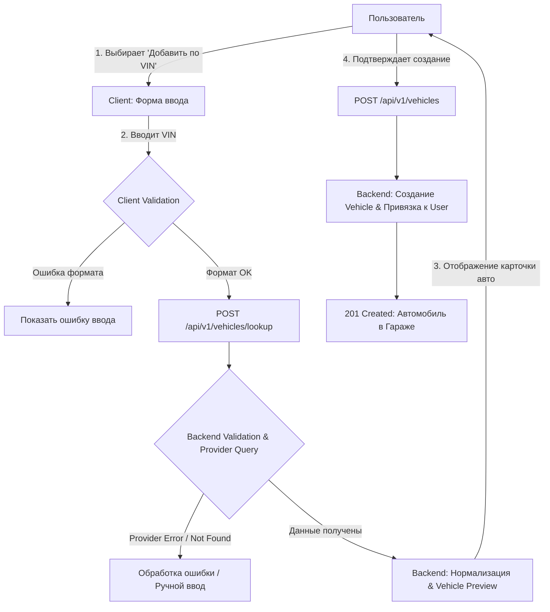

# UC-001 — Добавление автомобиля по VIN

> **Паспорт Use Case**
> | Параметр | Значение |
> | --- | --- |
> | **ID / Название** | UC-001: Add Vehicle by VIN (Добавление автомобиля по VIN) |
> | **Приоритет** | P0 (Critical) |
> | **Primary Actor** | Owner (Авторизованный пользователь) |
> | **Supporting Actor** | Vehicle Data Provider (Внешний сервис декодирования VIN) |
> | **Система** | Карманный гараж (Digital Garage) |
> | **Связанные BR** | BR-01, BR-02 |
> 
> 

---

## 1. Цель и контекст

Предоставить пользователю возможность добавить автомобиль в личный гараж по VIN-коду с автоматическим предзаполнением технических характеристик.

Успешное выполнение создаёт сущность `Vehicle`, привязанную к аккаунту пользователя, и открывает доступ к дальнейшему функционалу: истории обслуживания, учету расходов, напоминаниям и подбору запчастей.

---

## 2. Участники и Предусловия

### Акторы

* **Vehicle Owner:** Пользователь, добавляющий ТС.
* **Vehicle Data Provider:** Внешнее API (получение марки, модели, поколения, года, двигателя).

### Предусловия

1. Пользователь зарегистрирован и авторизован в приложении.
2. Сервис «Карманный гараж» и интеграция с внешним провайдером данных активны.

### Постусловия

* **Success:** Создана сущность `Vehicle` с уникальным ID, данные записаны в БД, авто отображается в гараже пользователя.
* **Failure:** Запись в БД не создается (транзакция откатывается), пользователь получает понятную ошибку, событие логируется.

---

## 3. Схема основного сценария (Main Flow)



---

## 4. Пошаговое выполнение (Main Success Scenario)

1. Пользователь в переходит в раздел **«Цифровой гараж»** и выбирает **«Добавить автомобиль»** $\rightarrow$ **«По VIN»**.
2. Пользователь вводит 17-значный VIN.
3. Клиент выполняет первичную валидацию (символы, длина).
4. Клиент отправляет запрос `POST /api/v1/vehicles/lookup`.
5. Backend нормализует VIN, запрашивает данные у `Vehicle Data Provider`.
6. Провайдер возвращает характеристики ТС (Марка, Модель, Поколение, Год, Двигатель).
7. Система отображает пользователю предварительную карточку (**Vehicle Preview**).
8. Пользователь подтверждает правильность найденного авто.
9. Backend атомарно создает запись `Vehicle` и связывает ее с `User ID`.
10. Автомобиль отображается в списке гаража.

---

## 5. Альтернативные сценарии и Ошибки

### Альтернативные сценарии (Alternative Flows)

* **A1: Некорректный формат VIN (Client side)**
* *Триггер:* Введены недопустимые символы (`I`, `O`, `Q`) или длина $\neq 17$.
* *Поведение:* Клиент блокирует отправку формы, подсвечивает поле ввода. Внешний API не вызывается.


* **A2: Автомобиль не найден у провайдера**
* *Триггер:* Провайдер возвращает `404 Not Found`.
* *Поведение:* Система сообщает «Автомобиль не найден» и предлагает перейти к ручному вводу параметров.


* **A3: Найдено несколько модификаций**
* *Триггер:* Провайдер возвращает список подходящих комплектаций.
* *Поведение:* Система выводит список вариантив, пользователь вручную выбирает точную модификацию перед подтверждением.


* **A4: Дубликат автомобиля у того же пользователя**
* *Триггер:* У текущего пользователя уже есть активный `Vehicle` с таким VIN.
* *Поведение:* Backend возвращает `409 Conflict`. Система предлагает сразу перейти в карточку существующего авто.


* **A5: Автомобиль привязан к другому аккаунту**
* *Триггер:* VIN зарегистрирован в системе под другим `User ID`.
* *Поведение:* Во избежание утечки персональных данных система выводит нейтральное сообщение: «Не удалось добавить автомобиль. Если это ваше ТС, пройдите процедуру подтверждения владения».


### Исключения (Exception Flows)

* **E1: Сбой или таймаут внешнего провайдера (502 / 504)**
* Система логирует `requestId`, выводит пользователю сообщение: *"Сервис декодирования временно недоступен. Попробуйте позже"*, и предоставляет кнопку «Повторить».


* **E2: Внутренняя ошибка сервера (500 Internal Error)**
* Транзакция откатывается. Пользователю выводится стандартная ошибка, инцидент фиксируется в системе мониторинга.


---

## 6. Бизнес-правила (Business Rules)

| Код | Правило |
| --- | --- |
| **BRULE-001** | Обязательная серверная валидация и нормализация VIN перед вызовом внешних сервисов. |
| **BRULE-002** | Каждый `Vehicle` обязан иметь строго определенного владельца (`User ID`). |
| **BRULE-003** | Запрещено создание дубликатов с одинаковым VIN в рамках одного аккаунта. |
| **BRULE-004** | Система не должна раскрывать данные о владельце ТС третьим лицам при совпадении VIN. |
| **BRULE-005** | Атомарность: запись автомобиля создается полностью или не создается вообще (без "частичных" объектов). |
| **BRULE-006** | Входные данные от сторонних API считаются ненадёжными и подлежат обязательному санитайзингу. |

---

## 7. Требования к системе

### Функциональные требования (FR)

| ID | Требование |
| --- | --- |
| **FR-001** | Форма ввода VIN с клиенсткой валидацией формата. |
| **FR-002** | Эндпоинт `POST /lookup` для получения предпросмотра ТС без сохранения в БД. |
| **FR-003** | Эндпоинт `POST /vehicles` для сохранения авто по `vehiclePreviewId`. |
| **FR-004** | Обязательное подтверждение (Explicit User Action) перед окончательным созданием ТС. |
| **FR-005** | Поддержка идемпотентности создания записей (`Idempotency-Key`). |

### Нефункциональные требования (NFR)

* **Performance:** Время ответа экрана Preview $\le 3$ сек (P95, без учета задержек внешнего API).
* **Security:** Передача данных только по HTTPS; маскирование VIN при отображении в общих списках (`JTNB********0001`).
* **Observability:** Все запросы к внешним провайдерам должны маркироваться единым `X-Request-ID`.

---

## 8. Критерии приемки (Acceptance Criteria)

```gherkin
Scenario: AC-001 Успешное добавление автомобиля по VIN
  Given Пользователь авторизован в приложении
  And Введен валидный VIN "JTNB11HK5K3000001"
  When Пользователь нажимает "Искать" и далее "Подтвердить" на экране Preview
  Then Создается запись Vehicle, связанная с текущим пользователем
  And Пользователь перенаправляется в "Цифровой гараж", где видит новый Toyota Camry

Scenario: AC-002 Валидация некорректного VIN на клиенте
  Given Пользователь находится на форме ввода VIN
  When Пользователь вводит "INVALID_VIN_123"
  Then Поле подсвечивается ошибкой "Некорректный формат VIN"
  And Запрос к бэкенду не отправляется

Scenario: AC-003 Дубликат авто у одного пользователя
  Given У пользователя уже добавлен авто с VIN "JTNB11HK5K3000001"
  When Пользователь пытается повторно добавить этот же VIN
  Then Система возвращает ошибку 409
  And Отображается предложение "Перейти к существующему автомобилю"

```

---

## 9. Риски и Открытые вопросы

### Риски (Risks)

| Риск | Уровень | Митигация |
| --- | --- | --- |
| **Низкая доступность внешнего API** | High | Кэширование успешных ответов; таймаут-политики (Circuit Breaker). |
| **Неполные данные от провайдера** | Medium | Возможность ручного редактирования недостающих полей после создания. |
| **Превышение лимитов (Rate Limit)** | Medium | Использование нескольких провайдеров (Fallback Provider). |
