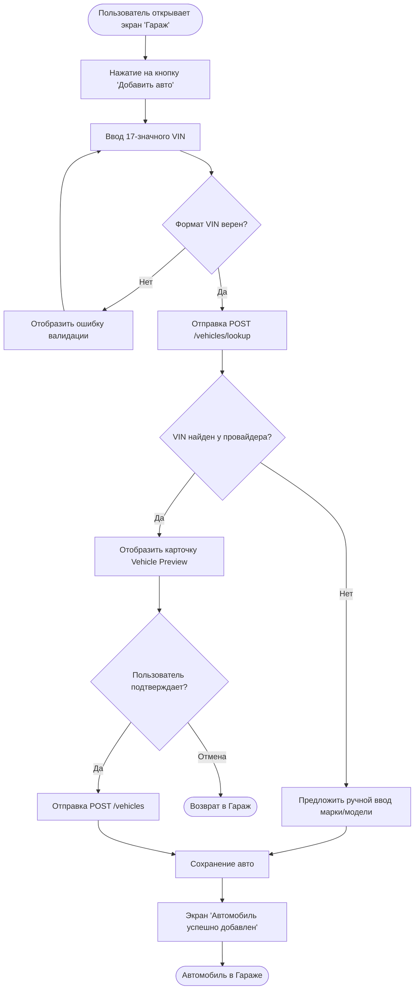
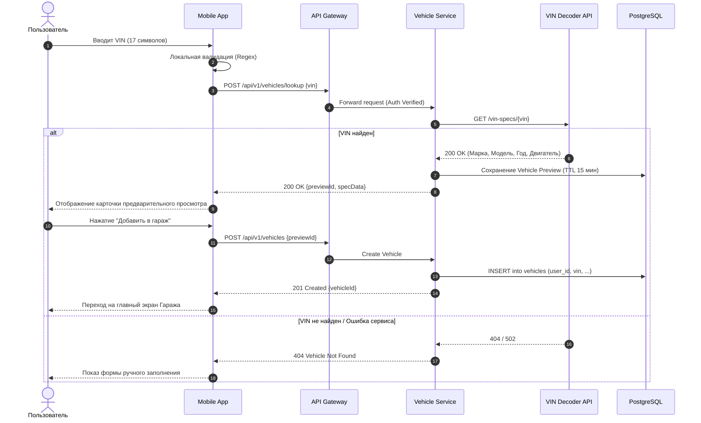
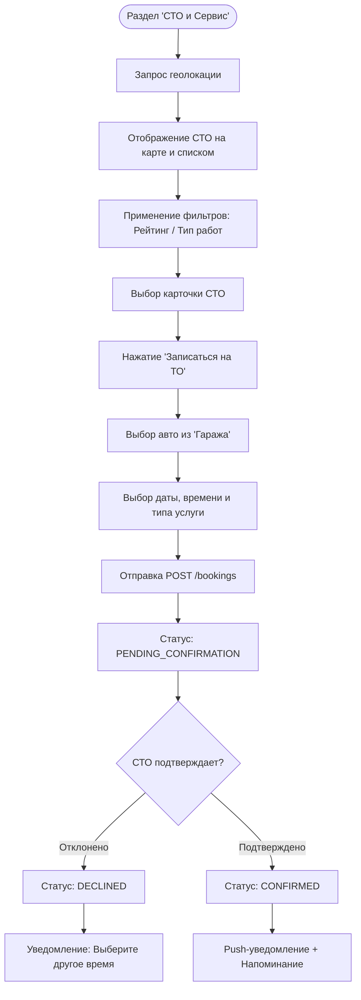
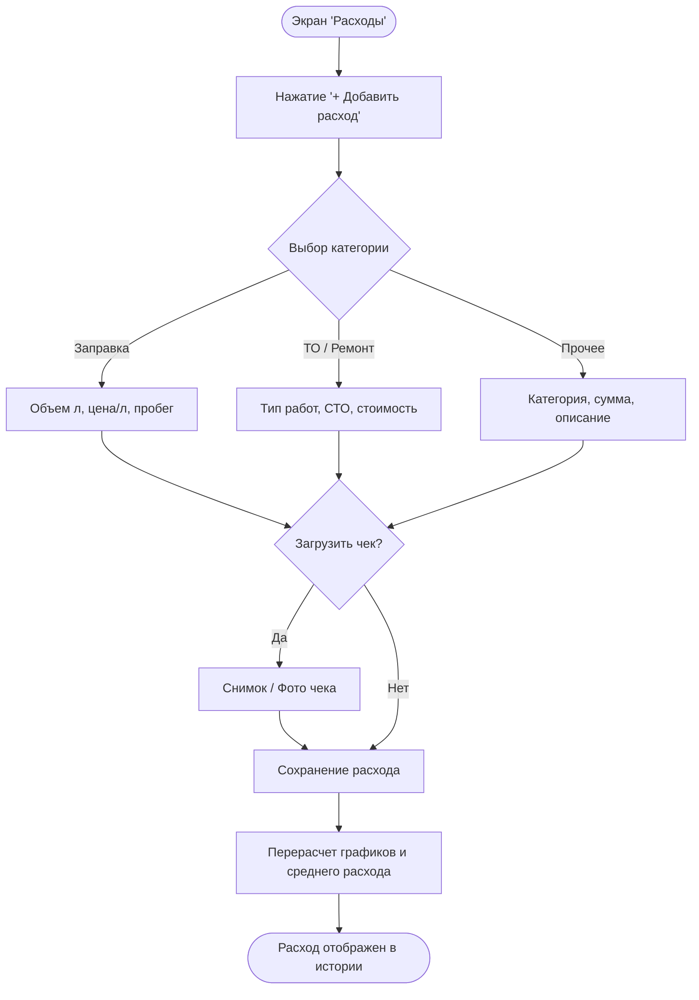

# User Flows & UX Scenarios — «Карманный гараж»

> **Паспорт документа**
>
> | Параметр | Значение |
> | :--- | :--- |
> | **Продукт** | Цифровая экосистема «Карманный гараж» |
> | **Тип документа** | UX Scenarios & Sequence Flows |
> | **Версия** | 1.0 (MVP) |

---

## 1. Назначение

Документ описывает основные пользовательские сценарии (User Flows), логику переходов между экранами мобильного приложения и последовательность взаимодействия компонентов системы (Sequence Diagrams).

---

## 2. Сценарий 1: Добавление автомобиля по VIN (UF-001)

### 2.1. Диаграмма процесса (Flowchart)

### 2.2. Sequence Diagram (Взаимодействие компонентов)

---

## 3. Сценарий 2: Поиск СТО и Онлайн-запись (UF-002)

### 3.1. Диаграмма процесса (Flowchart)

---

## 4. Сценарий 3: Учет расходов и внесение ТО (UF-003)

### 4.1. Диаграмма процесса (Flowchart)

---

## 5. Таблица состояний и переходов (State Transitions)

### Состояния заявки на запись (Booking Statuses)

| Текущее состояние | Событие (Event) | Новое состояние | Инициатор |
| --- | --- | --- | --- |
| **`REQUESTED`** | Пользователь отправил форму | `REQUESTED` | Пользователь |
| **`REQUESTED`** | СТО подтвердила дату и время | `CONFIRMED` | СТО (Партнер) |
| **`REQUESTED`** | СТО отклонила заявку | `DECLINED` | СТО (Партнер) |
| **`REQUESTED`** | Пользователь отменил заявку | `CANCELLED` | Пользователь |
| **`CONFIRMED`** | Услуга успешно оказана | `COMPLETED` | СТО / Пользователь |
| **`CONFIRMED`** | Пользователь не приехал в назначенное время | `NO_SHOW` | СТО |
